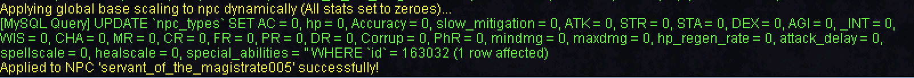
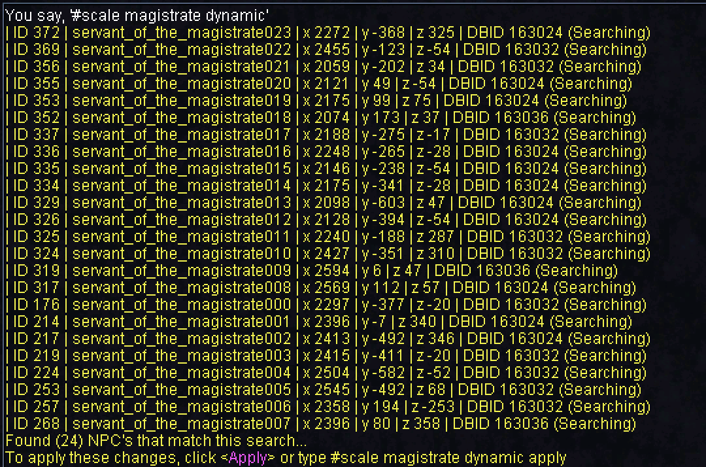
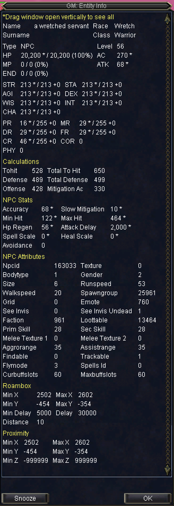

# NPC Scaling

One of the first introductions of a native scaling system includes **Global Base NPC Scaling**, profile based is planned for a later release but for now we will be covering the global system.

## Global Base NPC Scaling

* Traditionally when scaling an entire zone whether it is for custom content or for PEQ's purposes, we start with a blank slate of the zone or NPCs that have been transplanted. Every individual NPC needs to be tweaked by hand to handle stat / combat scaling for content unless you are using custom scripted solutions. We needed an easier way to at least handle the **base** scaling

### Introduction and Data Structure

* Take a look at the table below, imagine that this data drives all of the stats for every NPC that you'd like to scale. In order to understand this a bit more we need to break a few things down.

### Type

| Type | Description | Determination |
| :---: | :---: | :---: |
| 0 | Trash | No special flags set |
| 1 | Named | Has flag **rare\_spawn** set in **npc\_types** to **1** - or - name has **\#** in the beginning - or - first character in name is capitalized |
| 2 | Raid | Has flag **rare\_spawn** set in **npc\_types** to **1** |

* This data is simply an example of Levels 50-52, but has data from every **Type**

```text
select * from npc_scale_global_base where level >= 50 and level <= 52 order by type;
```

### How Attributes are Loaded

* The stats in the table will apply to an NPC when their original stat or attribute is 0 in the database, so to let an NPC be completely handled by this table you would set all the following stats to 0 in the `npc_types` table
* As alluded to before, each NPC is keyed off of **type** and **level**, so if an NPC is flagged as a named and is level 52, it will inherit the values from the row of **type 1** and **level 52** which has an **hp** value of 16080, this happens immediately upon spawn / repop

| \*type | \*level | ac | hp | accuracy | slow\_mitigation | attack | strength | stamina | dexterity | agility | intelligence | wisdom | charisma | magic\_resist | cold\_resist | fire\_resist | poison\_resist | disease\_resist | corruption\_resist | physical\_resist | min\_dmg | max\_dmg | hp\_regen\_rate | attack\_delay | spell\_scale | heal\_scale | special\_abilities |
| :--- | :--- | :--- | :--- | :--- | :--- | :--- | :--- | :--- | :--- | :--- | :--- | :--- | :--- | :--- | :--- | :--- | :--- | :--- | :--- | :--- | :--- | :--- | :--- | :--- | :--- | :--- | :--- |
| 0 | 50 | 245 | 10000 | 50 | 0 | 50 | 194 | 194 | 194 | 194 | 194 | 194 | 194 | 26 | 26 | 26 | 26 | 26 | 41 | 10 | 74 | 204 | 50 | 21 | 100 | 100 |  |
| 0 | 51 | 249 | 11700 | 53 | 0 | 53 | 197 | 197 | 197 | 197 | 197 | 197 | 197 | 27 | 27 | 27 | 27 | 27 | 42 | 11 | 78 | 231 | 51 | 20 | 100 | 100 |  |
| 0 | 52 | 253 | 13400 | 56 | 0 | 56 | 200 | 200 | 200 | 200 | 200 | 200 | 200 | 27 | 27 | 27 | 27 | 27 | 43 | 12 | 81 | 258 | 52 | 20 | 100 | 100 |  |
| 1 | 50 | 294 | 12000 | 60 | 0 | 60 | 233 | 233 | 233 | 233 | 233 | 233 | 233 | 31 | 31 | 31 | 31 | 31 | 49 | 12 | 89 | 245 | 60 | 21 | 100 | 100 | 13,1^14,1^21,1 |
| 1 | 51 | 299 | 14040 | 64 | 0 | 64 | 236 | 236 | 236 | 236 | 236 | 236 | 236 | 32 | 32 | 32 | 32 | 32 | 50 | 13 | 94 | 277 | 61 | 20 | 100 | 100 | 13,1^14,1^21,1 |
| 1 | 52 | 304 | 16080 | 67 | 0 | 67 | 240 | 240 | 240 | 240 | 240 | 240 | 240 | 32 | 32 | 32 | 32 | 32 | 52 | 14 | 97 | 310 | 62 | 20 | 100 | 100 | 13,1^14,1^21,1 |
| 2 | 50 | 368 | 100000 | 75 | 0 | 75 | 291 | 291 | 291 | 291 | 291 | 291 | 291 | 100 | 100 | 100 | 100 | 100 | 100 | 15 | 111 | 306 | 75 | 21 | 100 | 100 | 1,1^2,1^8,1^13,1^14,1^15,1^16,1^17,1^21,1^31,1 |
| 2 | 51 | 374 | 130000 | 80 | 0 | 80 | 296 | 296 | 296 | 296 | 296 | 296 | 296 | 102 | 102 | 102 | 102 | 102 | 102 | 17 | 117 | 347 | 77 | 20 | 100 | 100 | 1,1^2,1^8,1^13,1^14,1^15,1^16,1^17,1^21,1^31,1 |
| 2 | 52 | 380 | 140000 | 84 | 0 | 84 | 300 | 300 | 300 | 300 | 300 | 300 | 300 | 104 | 104 | 104 | 104 | 104 | 104 | 18 | 122 | 387 | 78 | 20 | 100 | 100 | 1,1^2,1^8,1^13,1^14,1^15,1^16,1^17,1^21,1^31,1 |

### Special Abilities

* For special abilities we load things slightly differently, we don't just look for having "no special abilities" on the NPC before we apply the template to them. In this implementation, we check to see if all of the base stats are actually zero value before we consider this NPC an **auto scaled** npc before deciding to apply **Special Abilities** from the database table template

```cpp
bool NpcScaleManager::IsAutoScaled(NPC *npc)
{
    return
        (npc->GetHP() == 0 &&
         npc->GetMaxDMG() == 0 &&
         npc->GetMinDMG() == 0 &&
         npc->GetSTR() == 0 &&
         npc->GetSTA() == 0 &&
         npc->GetDEX() == 0 &&
         npc->GetAGI() == 0 &&
         npc->GetINT() == 0 &&
         npc->GetWIS() == 0 &&
         npc->GetCHA() == 0 &&
         npc->GetMR() == 0 &&
         npc->GetFR() == 0 &&
         npc->GetCR() == 0 &&
         npc->GetPR() == 0 &&
         npc->GetDR() == 0);
}
```

### Scaling Commands

* **scale \[static/dynamic\] \(With targeted NPC\)**
* **scale \[npc\_name\_search\] \[static/dynamic\] \(To make zone-wide changes\)**
* **scale all \[static/dynamic\]**

With the above commands, static essentially going to take the scaling profile from the table above and applied it directory to the `npc_types` data on the NPC itself

### Example: \#scale static


### Example: \#scale dynamic



### Name Search

Similarly, the static and dynamic commands work based on a name search filter



You must click  before actually pushing the changes to make sure it is the change you want to make


### Zonewide

To simply change everything in the zone you can use **\#scale all \[static/dynamic\]** - just like name search it will ask for confirmation before applying

### Logging

To see stats being loaded on NPC's during a repop or spawn, under the **NPC Scaling** logging category you can see attributes that are being applied to the NPC. The below is a snippet from a \#repop in **Griegs End**

```text
[NPC Scaling] (a shrouded willsapper) level: 54 type: 0 Auto: true Setting: ac: 261 max_hp: 16800 accuracy: 62 slow_mitigation: 10 atk: 62 str: 206 sta: 206 dex: 206 agi: 206 int: 206 wis: 206 cha: 206 mr: 28 cr: 44 fr: 28 pr: 14 dr: 28 cr: 44 pr: 14 min_hit: 48 max_hit: 169 hp_regen: 54 attack_delay: 20 spell_scale: 100 heal_scale: 100 special_abilities:
[NPC Scaling] (a shrouded willsapper) level: 53 type: 0 Auto: true Setting: ac: 257 max_hp: 15100 accuracy: 59 slow_mitigation: 0 atk: 59 str: 203 sta: 203 dex: 203 agi: 203 int: 203 wis: 203 cha: 203 mr: 28 cr: 43 fr: 28 pr: 13 dr: 28 cr: 43 pr: 13 min_hit: 46 max_hit: 154 hp_regen: 53 attack_delay: 20 spell_scale: 100 heal_scale: 100 special_abilities:
[NPC Scaling] (a shrouded willsapper) level: 53 type: 0 Auto: true Setting: ac: 257 max_hp: 15100 accuracy: 59 slow_mitigation: 0 atk: 59 str: 203 sta: 203 dex: 203 agi: 203 int: 203 wis: 203 cha: 203 mr: 28 cr: 43 fr: 28 pr: 13 dr: 28 cr: 43 pr: 13 min_hit: 46 max_hit: 154 hp_regen: 53 attack_delay: 20 spell_scale: 100 heal_scale: 100 special_abilities:
[NPC Scaling] (a shrouded willsapper) level: 54 type: 0 Auto: true Setting: ac: 261 max_hp: 16800 accuracy: 62 slow_mitigation: 10 atk: 62 str: 206 sta: 206 dex: 206 agi: 206 int: 206 wis: 206 cha: 206 mr: 28 cr: 44 fr: 28 pr: 14 dr: 28 cr: 44 pr: 14 min_hit: 48 max_hit: 169 hp_regen: 54 attack_delay: 20 spell_scale: 100 heal_scale: 100 special_abilities:
[NPC Scaling] (a shrouded willsapper) level: 55 type: 0 Auto: true Setting: ac: 266 max_hp: 18500 accuracy: 65 slow_mitigation: 10 atk: 65 str: 210 sta: 210 dex: 210 agi: 210 int: 210 wis: 210 cha: 210 mr: 29 cr: 45 fr: 29 pr: 15 dr: 29 cr: 45 pr: 15 min_hit: 50 max_hit: 184 hp_regen: 55 attack_delay: 20 spell_scale: 100 heal_scale: 100 special_abilities:
[NPC Scaling] (a shrouded willsapper) level: 53 type: 0 Auto: true Setting: ac: 257 max_hp: 15100 accuracy: 59 slow_mitigation: 0 atk: 59 str: 203 sta: 203 dex: 203 agi: 203 int: 203 wis: 203 cha: 203 mr: 28 cr: 43 fr: 28 pr: 13 dr: 28 cr: 43 pr: 13 min_hit: 46 max_hit: 154 hp_regen: 53 attack_delay: 20 spell_scale: 100 heal_scale: 100 special_abilities:
[NPC Scaling] (a defiled dreamweaver) level: 54 type: 0 Auto: true Setting: ac: 261 max_hp: 16800 accuracy: 62 slow_mitigation: 10 atk: 62 str: 206 sta: 206 dex: 206 agi: 206 int: 206 wis: 206 cha: 206 mr: 28 cr: 44 fr: 28 pr: 14 dr: 28 cr: 44 pr: 14 min_hit: 60 max_hit: 212 hp_regen: 54 attack_delay: 20 spell_scale: 100 heal_scale: 100 special_abilities:
[NPC Scaling] (a deadly dreamweaver) level: 54 type: 0 Auto: true Setting: ac: 261 max_hp: 16800 accuracy: 62 slow_mitigation: 10 atk: 62 str: 206 sta: 206 dex: 206 agi: 206 int: 206 wis: 206 cha: 206 mr: 28 cr: 44 fr: 28 pr: 14 dr: 28 cr: 44 pr: 14 min_hit: 48 max_hit: 169 hp_regen: 54 attack_delay: 20 spell_scale: 100 heal_scale: 100 special_abilities:
[NPC Scaling] (a shadowy figure) level: 58 type: 0 Auto: true Setting: ac: 278 max_hp: 23600 accuracy: 74 slow_mitigation: 10 atk: 74 str: 219 sta: 219 dex: 219 agi: 219 int: 219 wis: 219 cha: 219 mr: 30 cr: 47 fr: 30 pr: 18 dr: 30 cr: 47 pr: 18 min_hit: 137 max_hit: 551 hp_regen: 58 attack_delay: 19 spell_scale: 100 heal_scale: 100 special_abilities: 8,1
[NPC Scaling] (a tormented pugilist) level: 55 type: 0 Auto: true Setting: ac: 266 max_hp: 18500 accuracy: 65 slow_mitigation: 10 atk: 65 str: 210 sta: 210 dex: 210 agi: 210 int: 210 wis: 210 cha: 210 mr: 29 cr: 45 fr: 29 pr: 15 dr: 29 cr: 45 pr: 15 min_hit: 118 max_hit: 430 hp_regen: 55 attack_delay: 20 spell_scale: 100 heal_scale: 100 special_abilities:
[NPC Scaling] (a tormented pugilist) level: 55 type: 0 Auto: true Setting: ac: 266 max_hp: 18500 accuracy: 65 slow_mitigation: 10 atk: 65 str: 210 sta: 210 dex: 210 agi: 210 int: 210 wis: 210 cha: 210 mr: 29 cr: 45 fr: 29 pr: 15 dr: 29 cr: 45 pr: 15 min_hit: 118 max_hit: 430 hp_regen: 55 attack_delay: 20 spell_scale: 100 heal_scale: 100 special_abilities:
[NPC Scaling] (a shrouded minion) level: 75 type: 2 Auto: true Setting: ac: 572 max_hp: 1850000 accuracy: 330 slow_mitigation: 75 atk: 310 str: 342 sta: 342 dex: 342 agi: 342 int: 342 wis: 342 cha: 342 mr: 150 cr: 150 fr: 150 pr: 80 dr: 150 cr: 150 pr: 80 min_hit: 1024 max_hit: 3816 hp_regen: 1500 attack_delay: 13 spell_scale: 100 heal_scale: 100 special_abilities: 1,1^2,1^8,1^13,1^14,1^15,1^16,1^17,1^21,1^31,1
[NPC Scaling] (a shrouded minion) level: 75 type: 2 Auto: true Setting: ac: 572 max_hp: 1850000 accuracy: 330 slow_mitigation: 75 atk: 310 str: 342 sta: 342 dex: 342 agi: 342 int: 342 wis: 342 cha: 342 mr: 150 cr: 150 fr: 150 pr: 80 dr: 150 cr: 150 pr: 80 min_hit: 1024 max_hit: 3816 hp_regen: 1500 attack_delay: 13 spell_scale: 100 heal_scale: 100 special_abilities: 1,1^2,1^8,1^13,1^14,1^15,1^16,1^17,1^21,1^31,1
[NPC Scaling] (an ancient necromantic shade) level: 80 type: 2 Auto: true Setting: ac: 608 max_hp: 2100000 accuracy: 380 slow_mitigation: 85 atk: 360 str: 362 sta: 362 dex: 362 agi: 362 int: 362 wis: 362 cha: 362 mr: 160 cr: 160 fr: 160 pr: 100 dr: 160 cr: 160 pr: 100 min_hit: 490 max_hit: 1905 hp_regen: 2000 attack_delay: 13 spell_scale: 100 heal_scale: 100 special_abilities: 1,1^2,1^8,1^13,1^14,1^15,1^16,1^17,1^21,1^31,1
[NPC Scaling] (a shrouded minion) level: 75 type: 2 Auto: true Setting: ac: 572 max_hp: 1850000 accuracy: 330 slow_mitigation: 75 atk: 310 str: 342 sta: 342 dex: 342 agi: 342 int: 342 wis: 342 cha: 342 mr: 150 cr: 150 fr: 150 pr: 80 dr: 150 cr: 150 pr: 80 min_hit: 1024 max_hit: 3816 hp_regen: 1500 attack_delay: 13 spell_scale: 100 heal_scale: 100 special_abilities: 1,1^2,1^8,1^13,1^14,1^15,1^16,1^17,1^21,1^31,1
[NPC Scaling] (a shrouded minion) level: 75 type: 2 Auto: true Setting: ac: 572 max_hp: 1850000 accuracy: 330 slow_mitigation: 75 atk: 310 str: 342 sta: 342 dex: 342 agi: 342 int: 342 wis: 342 cha: 342 mr: 150 cr: 150 fr: 150 pr: 80 dr: 150 cr: 150 pr: 80 min_hit: 1024 max_hit: 3816 hp_regen: 1500 attack_delay: 13 spell_scale: 100 heal_scale: 100 special_abilities: 1,1^2,1^8,1^13,1^14,1^15,1^16,1^17,1^21,1^31,1
[NPC Scaling] (a tormented pugilist) level: 54 type: 0 Auto: true Setting: ac: 261 max_hp: 16800 accuracy: 62 slow_mitigation: 10 atk: 62 str: 206 sta: 206 dex: 206 agi: 206 int: 206 wis: 206 cha: 206 mr: 28 cr: 44 fr: 28 pr: 14 dr: 28 cr: 44 pr: 14 min_hit: 113 max_hit: 395 hp_regen: 54 attack_delay: 20 spell_scale: 100 heal_scale: 100 special_abilities:
[NPC Scaling] (a tormented mercenary) level: 54 type: 0 Auto: true Setting: ac: 261 max_hp: 16800 accuracy: 62 slow_mitigation: 10 atk: 62 str: 206 sta: 206 dex: 206 agi: 206 int: 206 wis: 206 cha: 206 mr: 28 cr: 44 fr: 28 pr: 14 dr: 28 cr: 44 pr: 14 min_hit: 113 max_hit: 395 hp_regen: 54 attack_delay: 20 spell_scale: 100 heal_scale: 100 special_abilities:
[NPC Scaling] (a mangled clairvoyant) level: 55 type: 0 Auto: true Setting: ac: 266 max_hp: 18500 accuracy: 65 slow_mitigation: 10 atk: 65 str: 210 sta: 210 dex: 210 agi: 210 int: 210 wis: 210 cha: 210 mr: 29 cr: 45 fr: 29 pr: 15 dr: 29 cr: 45 pr: 15 min_hit: 50 max_hit: 184 hp_regen: 55 attack_delay: 20 spell_scale: 100 heal_scale: 100 special_abilities:
```

### DevTools

You can also see which attributes are applied to an NPC using the DevTools mob info display window \(Targeting an NPC\). Any stat that has been loaded from the global scale system has an asterisk next to it



