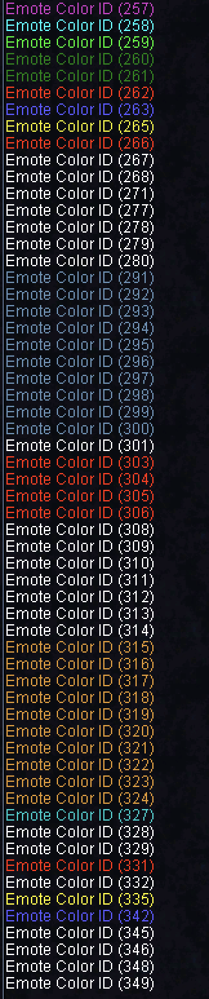

# Emote Colors

These colors are available to the Quest API:

| ID | Color |
| :--- | :--- |
| 0 | white |
| 1 | gray |
| 2 | dark green |
| 3 | gray |
| 4 | light blue |
| 5 | light purple |
| 6 | grey |
| 7 | white |
| 8 | grey |
| 9 | grey |
| 10 | white |
| 11 | grey |
| 12 | light silver |
| 13 | red |
| 14 | light green |
| 15 | yellow |
| 16 | dark blue |
| 17 | grey |
| 18 | cyan |
| 257 | darkish purple |
| 258 | lighter cyan |
| 259 | green, light |
| 260 | ooc green, slightly lighter |
| 261 | ooc green, slightly lighter |
| 263 | blue, emote/spell |
| 264 | blue emote, filters under spells |
| 269 | yellow, filters under broadcast |
| 270 | blue, filters under broadcast |
| 271 | white, filters under spells |
| 272 | white, filters under broadcast |
| 300 | odd blue color |
| 315 | Maroon |

### Example Snippet for Colors

```perl
if ($text=~/colors/i) {
        for ($i = 0; $i < 100; $i++) {
                $client->Message($i, "Emote Color ID (" . $i . ")");
        }
}
```

#### Results

{: style="width:300px"}

{: style="width:200px"}


