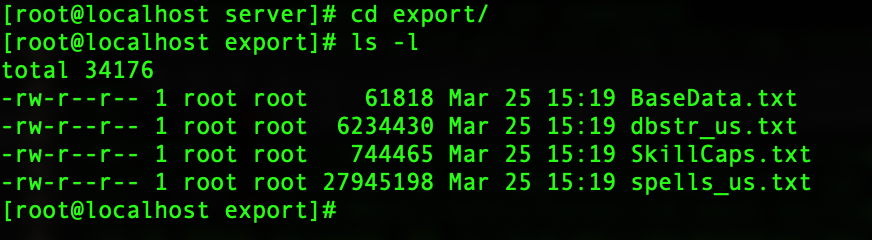

# Client Spell ID Limitations

If you make ANY changes to the spells on your server, you will have to generate a new `spells_us.txt` file.  It is important to note that your database probably has MANY spells inside, as EQEmu attempts to support all of the spells that are available.  


If you're creating your own `spells_us.txt` file, please make sure that the maximum id of the spells in your `spells_new` database table is below the value listed below.


| **Client** | **Max Spell ID** |
| :--- | :--- |
| Titanium | 9,999 |
| Secrets of Faydwer | 15,999 |
| Seeds of Destruction | 23,000 |
| Underfoot | 28,000 |
| Rain of Fear | 45,000 |
| Rain of Fear 2 | 45,000 |
| The Darkend Sea (not yet supported) | 50,000 |

To generate your new `spells_us.txt` file:

1.) Go to your server directory (Linux example below):

```text
cd /home/eqemu/server
```

2.) Create an `export` directory (you only need to do this the first time):

```text
mkdir export
```

3.) Run the `export_client_files` binary:

```text
./export_client_files
```

You should then find a copy of the exported client files in your `export` directory:



