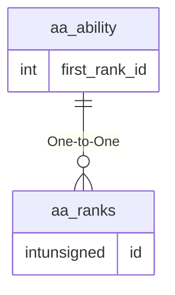

# aa_ability

!!! info
	This page was last generated 2024.02.07

## Relationship Diagram(s)

## Relationships

| Relationship Type | Local Key | Relates to Table | Foreign Key |
| :--- | :--- | :--- | :--- |
| One-to-One | first_rank_id | [aa_ranks](../../schema/aas/aa_ranks.md) | id |

## Schema

| Column | Data Type | Description |
| :--- | :--- | :--- |
| id | int | Unique AA Identifier |
| name | text | Name |
| category | int | [AA Category](../../../../server/aas/aa-categories) |
| classes | int | [Classes](../../../../server/player/class-list) Bitmasks |
| races | int | [Races](../../../../server/npc/race-list) |
| drakkin_heritage | int | Drakkin Heritage: 127 = All |
| deities | int | [Deities](../../../../server/player/deity-list) |
| status | int | [Minimum Status](../../../../server/player/status-levels) |
| type | int | [AA Type](../../../../server/aas/aa-types) |
| charges | int | Number of Charges |
| grant_only | tinyint | Grant Only Flag: 0 = No, 1 = Yes |
| first_rank_id | int | First Rank Identifier |
| enabled | tinyint | Enabled: 0 = No, 1 = Yes |
| reset_on_death | tinyint | Reset on Death: 0 = False, 1 = True |
| auto_grant_enabled | tinyint |  |

