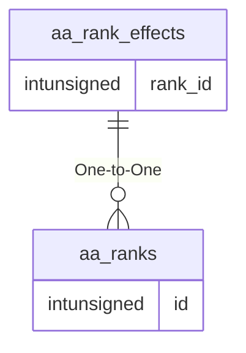

# aa_rank_effects

## Relationships

| Relationship Type | Local Key | Relates to Table | Foreign Key |
| :--- | :--- | :--- | :--- |
| One-to-One | rank_id | [aa_ranks](../../schema/aas/aa_ranks.md) | id |

## Schema

| Column | Data Type | Description |
| :--- | :--- | :--- |
| rank_id | int | [Rank Identifier](aa_ranks.md) |
| slot | int | AA Slot |
| effect_id | int | [Spell Effect Identifier](../../../../server/spells/spell-effect-ids) |
| base1 | int | First Base Value |
| base2 | int | Second Base Value |

