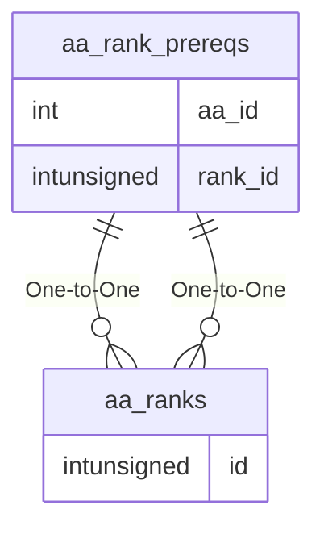

# aa_rank_prereqs

## Relationships

| Relationship Type | Local Key | Relates to Table | Foreign Key |
| :--- | :--- | :--- | :--- |
| One-to-One | aa_id | [aa_ranks](../../schema/aas/aa_ranks.md) | id |
| One-to-One | rank_id | [aa_ranks](../../schema/aas/aa_ranks.md) | id |

## Schema

| Column | Data Type | Description |
| :--- | :--- | :--- |
| rank_id | int | [Rank Identifier](aa_ranks.md) |
| aa_id | int | [AA Identifier](aa_ability.md) |
| points | int | Cost in AA Points |

