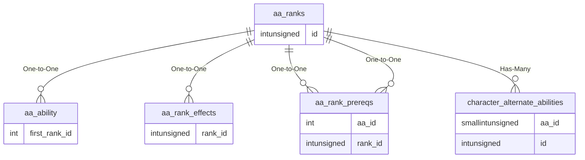

# aa_ranks

## Relationships

| Relationship Type | Local Key | Relates to Table | Foreign Key |
| :--- | :--- | :--- | :--- |
| One-to-One | id | [aa_ability](../../schema/aas/aa_ability.md) | first_rank_id |
| One-to-One | id | [aa_rank_effects](../../schema/aas/aa_rank_effects.md) | rank_id |
| One-to-One | id | [aa_rank_prereqs](../../schema/aas/aa_rank_prereqs.md) | aa_id |
| One-to-One | id | [aa_rank_prereqs](../../schema/aas/aa_rank_prereqs.md) | rank_id |
| Has-Many | id | [character_alternate_abilities](../../schema/characters/character_alternate_abilities.md) | aa_id |

## Schema

| Column | Data Type | Description |
| :--- | :--- | :--- |
| id | int | [AA Identifier](aa_ability.md) |
| upper_hotkey_sid | int | Upper Hotkey SID |
| lower_hotkey_sid | int | Lower Hotkey SID |
| title_sid | int | Title SID |
| desc_sid | int | Description SID |
| cost | int | Cost in AA Points |
| level_req | int | Level Required |
| spell | int | [Spell Identifier](../../schema/spells/spells_new.md) |
| spell_type | int | [Spell Type](../../../../server/spells/spell-types) |
| recast_time | int | Recast Timer |
| expansion | int | [Expansion Identifier](../../../../server/operation/expansion-list) |
| prev_id | int | Previous Rank Identifier |
| next_id | int | Next Rank Identifier |

