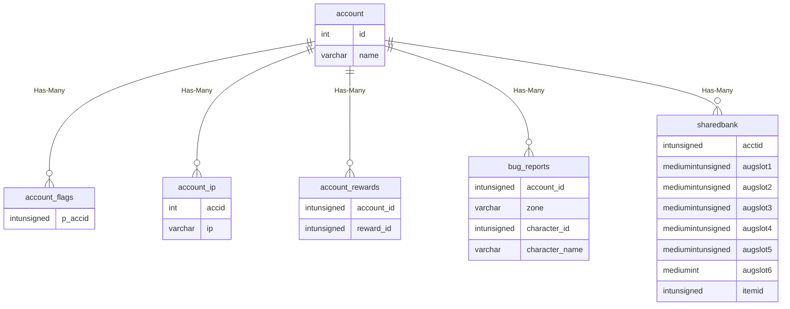
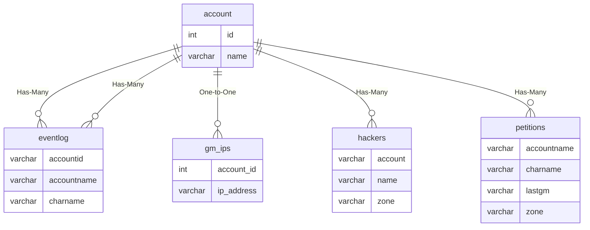

# account

!!! info
	This page was last generated 2024.02.07

## Relationship Diagram(s)

## Relationships

| Relationship Type | Local Key | Relates to Table | Foreign Key |
| :--- | :--- | :--- | :--- |
| Has-Many | id | [account_flags](../../schema/account/account_flags.md) | p_accid |
| Has-Many | id | [account_ip](../../schema/account/account_ip.md) | accid |
| Has-Many | id | [account_rewards](../../schema/account/account_rewards.md) | account_id |
| Has-Many | id | [bug_reports](../../schema/admin/bug_reports.md) | account_id |
| Has-Many | id | [sharedbank](../../schema/account/sharedbank.md) | acctid |
| Has-Many | id | [eventlog](../../schema/admin/eventlog.md) | accountid |
| One-to-One | id | [gm_ips](../../schema/admin/gm_ips.md) | account_id |
| Has-Many | name | [eventlog](../../schema/admin/eventlog.md) | accountname |
| Has-Many | name | [hackers](../../schema/admin/hackers.md) | account |
| Has-Many | name | [petitions](../../schema/admin/petitions.md) | accountname |

## Schema

| Column | Data Type | Description |
| :--- | :--- | :--- |
| id | int | Unique Account Identifier |
| name | varchar | Name |
| charname | varchar | Character name last logged in on this account. |
| sharedplat | int | Platinum in Shared Bank. |
| password | varchar | Private loginserver password. |
| status | int | [Status](../../../../server/player/status-levels) |
| ls_id | varchar | Loginserver ID |
| lsaccount_id | int | Loginserver Account Identifier |
| gmspeed | tinyint | GM Speed: 0 = Disabled, 1 = Enabled |
| invulnerable | tinyint | Invulnerable: 0 = False, 1 = True |
| flymode | tinyint | [Fly Mode](../../../../server/npc/fly-modes) |
| ignore_tells | tinyint | Ignore Tells: 0 = False, 1 = True |
| revoked | tinyint | OOC Revoked: 0 = False, 1 = True |
| karma | int | Karma |
| minilogin_ip | varchar | Minilogin IP Address |
| hideme | tinyint | Hide Me: 0 = Disabled, 1 = Enabled |
| rulesflag | tinyint | Rules Flag |
| suspendeduntil | datetime | Time Suspension of the Account ends |
| time_creation | int | Time Creation UNIX Timestamp |
| expansion | tinyint | Expansion |
| suspend_reason | text | Suspension Reason |
| crc_eqgame | text | CRC for EQGame.exe |
| crc_skillcaps | text | CRC for SkillCaps file |
| crc_basedata | text | CRC for BaseData file |

