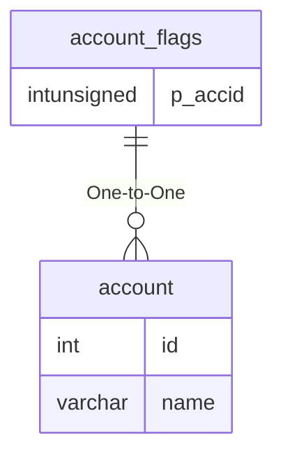

# account_flags

!!! info
	This page was last generated 2024.02.07

## Relationship Diagram(s)

## Relationships

| Relationship Type | Local Key | Relates to Table | Foreign Key |
| :--- | :--- | :--- | :--- |
| One-to-One | p_accid | [account](../../schema/account/account.md) | id |

## Schema

| Column | Data Type | Description |
| :--- | :--- | :--- |
| p_accid | int | [Account Identifier](account.md) |
| p_flag | varchar | Name |
| p_value | varchar | Value |

