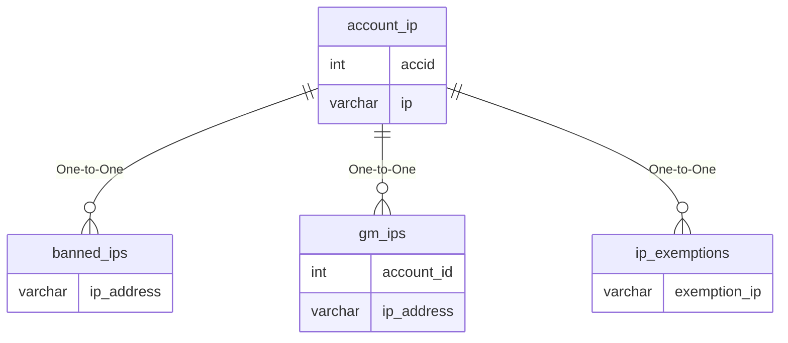

# account_ip

## Relationships

| Relationship Type | Local Key | Relates to Table | Foreign Key |
| :--- | :--- | :--- | :--- |
| One-to-One | ip | [banned_ips](../../schema/admin/banned_ips.md) | ip_address |
| One-to-One | ip | [gm_ips](../../schema/admin/gm_ips.md) | ip_address |
| One-to-One | ip | [ip_exemptions](../../schema/admin/ip_exemptions.md) | exemption_ip |

## Schema

| Column | Data Type | Description |
| :--- | :--- | :--- |
| accid | int | [Account Identifier](account.md) |
| ip | varchar | IP Address |
| count | int | Number of times logged in from this IP |
| lastused | timestamp | Timestamp of when account was last logged in |

