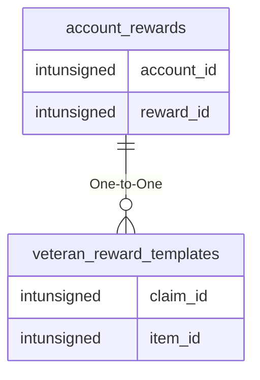

# account_rewards

## Relationships

| Relationship Type | Local Key | Relates to Table | Foreign Key |
| :--- | :--- | :--- | :--- |
| One-to-One | reward_id | [veteran_reward_templates](../../schema/admin/veteran_reward_templates.md) | claim_id |

## Schema

| Column | Data Type | Description |
| :--- | :--- | :--- |
| account_id | int | [Account Identifier](account.md) |
| reward_id | int | [Veteran Reward Identifier](../../schema/admin/veteran_reward_templates.md) |
| amount | int | Amount |

