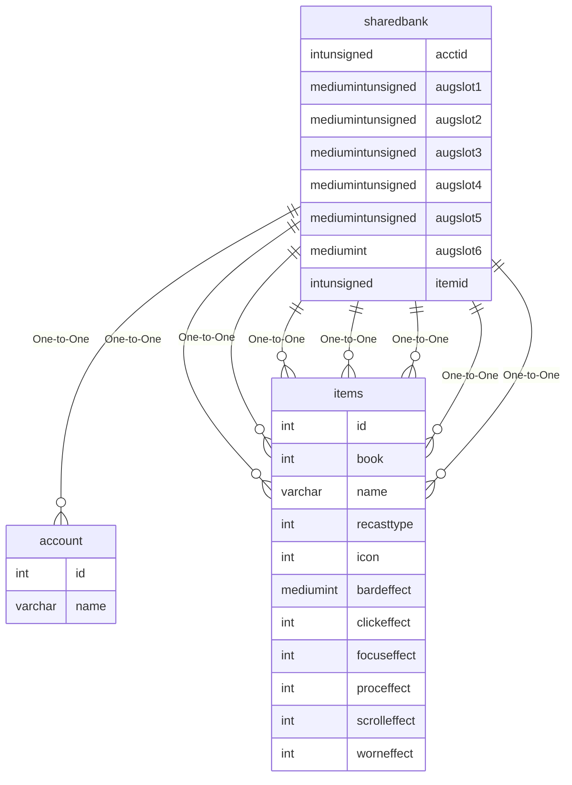

# sharedbank

!!! info
	This page was last generated 2024.02.07

## Relationship Diagram(s)

## Relationships

| Relationship Type | Local Key | Relates to Table | Foreign Key |
| :--- | :--- | :--- | :--- |
| One-to-One | acctid | [account](../../schema/account/account.md) | id |
| One-to-One | augslot1 | [items](../../schema/items/items.md) | id |
| One-to-One | augslot2 | [items](../../schema/items/items.md) | id |
| One-to-One | augslot3 | [items](../../schema/items/items.md) | id |
| One-to-One | augslot4 | [items](../../schema/items/items.md) | id |
| One-to-One | augslot5 | [items](../../schema/items/items.md) | id |
| One-to-One | augslot6 | [items](../../schema/items/items.md) | id |
| One-to-One | itemid | [items](../../schema/items/items.md) | id |

## Schema

| Column | Data Type | Description |
| :--- | :--- | :--- |
| acctid | int | [Unique Account Identifier](account.md) |
| slotid | mediumint | [Slot Identifier](../../../../server/inventory/inventory-slots) |
| itemid | int | [Item Identifier](../../schema/items/items.md) |
| charges | smallint | Charges |
| augslot1 | mediumint | Augment Slot 1 |
| augslot2 | mediumint | Augment Slot 2 |
| augslot3 | mediumint | Augment Slot 3 |
| augslot4 | mediumint | Augment Slot 4 |
| augslot5 | mediumint | Augment Slot 5 |
| augslot6 | mediumint | Augment Slot 6 |
| custom_data | text | Custom Data |

