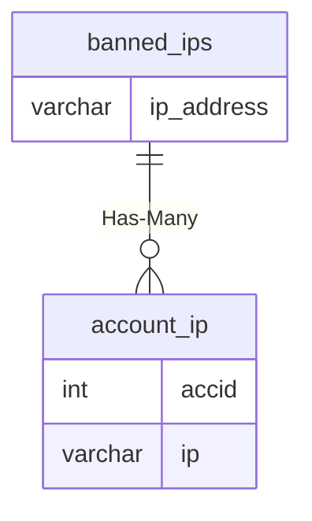

# banned_ips

## Relationships

| Relationship Type | Local Key | Relates to Table | Foreign Key |
| :--- | :--- | :--- | :--- |
| Has-Many | ip_address | [account_ip](../../schema/account/account_ip.md) | ip |

## Schema

| Column | Data Type | Description |
| :--- | :--- | :--- |
| ip_address | varchar | [IP Address](../../schema/account/account_ip.md) |
| notes | varchar | Ban reason |

