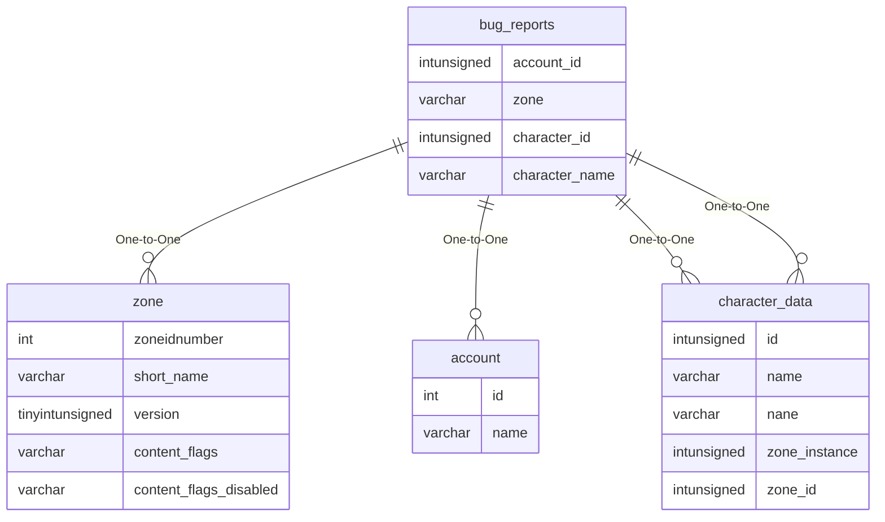

# bug_reports

## Relationships

| Relationship Type | Local Key | Relates to Table | Foreign Key |
| :--- | :--- | :--- | :--- |
| One-to-One | zone | [zone](../../schema/zone/zone.md) | short_name |
| One-to-One | account_id | [account](../../schema/account/account.md) | id |
| One-to-One | character_id | [character_data](../../schema/characters/character_data.md) | id |
| One-to-One | character_name | [character_data](../../schema/characters/character_data.md) | name |

## Schema

| Column | Data Type | Description |
| :--- | :--- | :--- |
| id | int | Unique Bug Report Identifier |
| zone | varchar | [Zone Short Name](../../../../server/zones/zone-list) |
| client_version_id | int | [Client Version Identifier](../../../../server/player/client-version-bitmasks) |
| client_version_name | varchar | [Client Version Name](../../../../server/player/client-version-bitmasks) |
| account_id | int | [Account Identifier](../../schema/account/account.md) |
| character_id | int | [Character Identifier](../../schema/characters/character_data.md) |
| character_name | varchar | [Character Name](../../schema/characters/character_data.md) |
| reporter_spoof | tinyint | Reporter Spoof |
| category_id | int | Category Identifier |
| category_name | varchar | Category Name |
| reporter_name | varchar | Reporter Name |
| ui_path | varchar | UI Path |
| pos_x | float | Position X Coordinate |
| pos_y | float | Position Y Coordinate |
| pos_z | float | Position Z Coordinate |
| heading | int | Heading Coordinate |
| time_played | int | Time Played in Seconds |
| target_id | int | Target Identifier |
| target_name | varchar | Target Name |
| optional_info_mask | int | Optional Info Mask: 0 = False, 1 = True |
| _can_duplicate | tinyint | Can Duplicate: 0 = False, 1 = True |
| _crash_bug | tinyint | Crash Bug |
| _target_info | tinyint | Target Info |
| _character_flags | tinyint | Character Flags |
| _unknown_value | tinyint | Unknown |
| bug_report | varchar | Bug Report |
| system_info | varchar | System Information |
| report_datetime | datetime | Report Datetime |
| bug_status | tinyint | Bug Status |
| last_review | datetime | Last Review Datetime |
| last_reviewer | varchar | Last Reviewer |
| reviewer_notes | varchar | Reviewer Notes |

