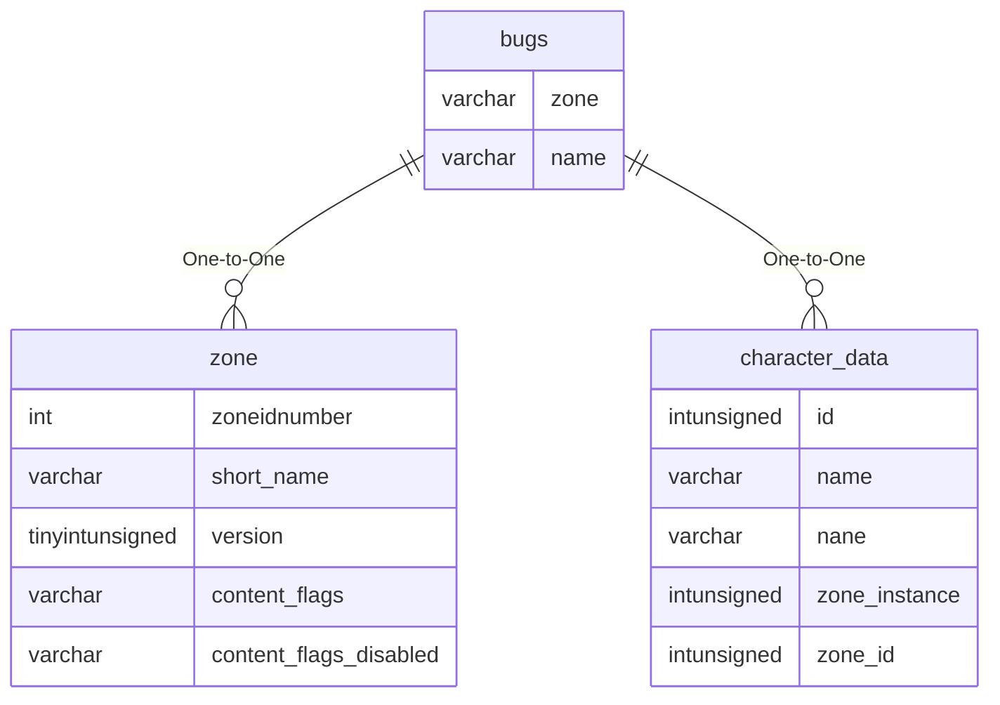

# bugs

!!! info
	This page was last generated 2024.02.07

## Relationship Diagram(s)

## Relationships

| Relationship Type | Local Key | Relates to Table | Foreign Key |
| :--- | :--- | :--- | :--- |
| One-to-One | zone | [zone](../../schema/zone/zone.md) | short_name |
| One-to-One | name | [character_data](../../schema/characters/character_data.md) | name |

## Schema

| Column | Data Type | Description |
| :--- | :--- | :--- |
| id | int | Unique Bug Identifier |
| zone | varchar | [Zone Short Name](../../../../server/zones/zone-list) |
| name | varchar | Player Name |
| ui | varchar | UI |
| x | float | X Coordinate |
| y | float | Y Coordinate |
| z | float | Z Coordinate |
| type | varchar | Type |
| flag | tinyint | Flag |
| target | varchar | Target when reported |
| bug | varchar | Bug reported |
| date | date | Date when reported |
| status | tinyint | [Account Status of Reporter]([../../../../server/player/status-levels](../../../../server/player/status-levels) |

