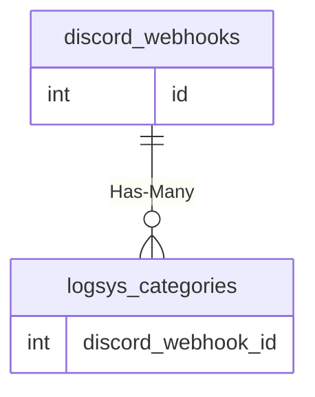

# discord_webhooks

!!! info
	This page was last generated 2024.02.07

## Relationship Diagram(s)

## Relationships

| Relationship Type | Local Key | Relates to Table | Foreign Key |
| :--- | :--- | :--- | :--- |
| Has-Many | id | [logsys_categories](../../schema/admin/logsys_categories.md) | discord_webhook_id |

## Schema

| Column | Data Type | Description |
| :--- | :--- | :--- |
| id | int | Unique Webhook Identifier |
| webhook_name | varchar | Webhook Name |
| webhook_url | varchar | Webhook URL |
| created_at | datetime | Created At |
| deleted_at | datetime | Deleted At |

