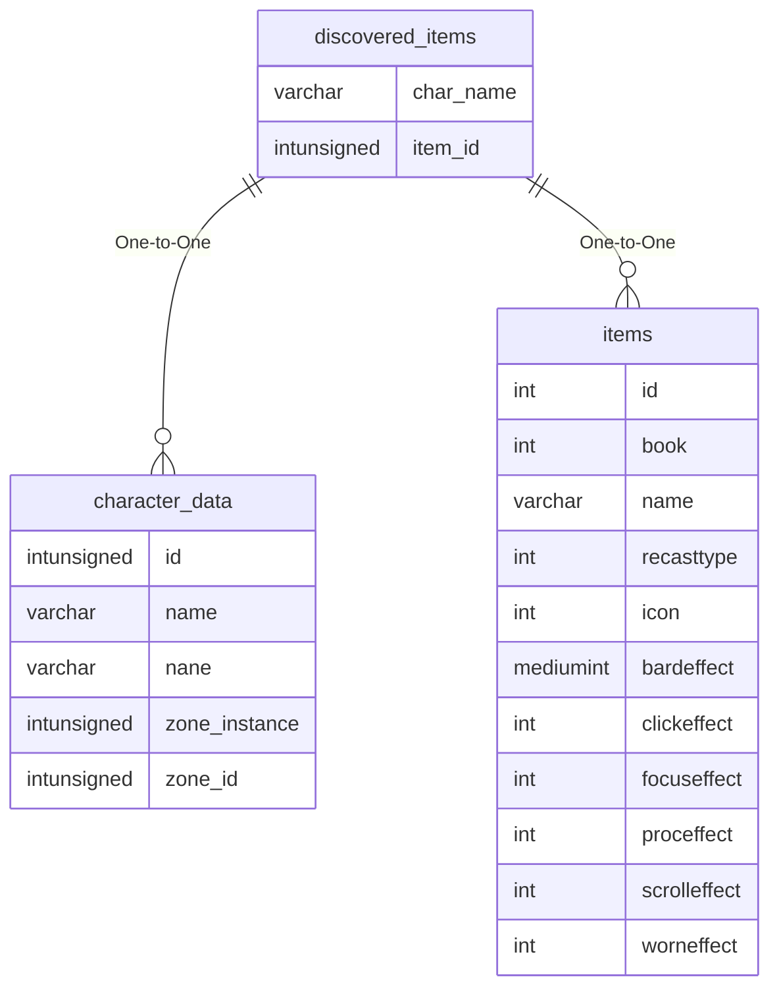

# discovered_items

!!! info
	This page was last generated 2024.02.07

## Relationship Diagram(s)

## Relationships

| Relationship Type | Local Key | Relates to Table | Foreign Key |
| :--- | :--- | :--- | :--- |
| One-to-One | char_name | [character_data](../../schema/characters/character_data.md) | name |
| One-to-One | item_id | [items](../../schema/items/items.md) | id |

## Schema

| Column | Data Type | Description |
| :--- | :--- | :--- |
| item_id | int | [Item Identifier](../../schema/items/items.md) |
| char_name | varchar | [Character Name](../../schema/characters/character_data.md) |
| discovered_date | int | Discovered Date UNIX Timestamp |
| account_status | int | [Account Status](../../../../server/player/status-levels) |

