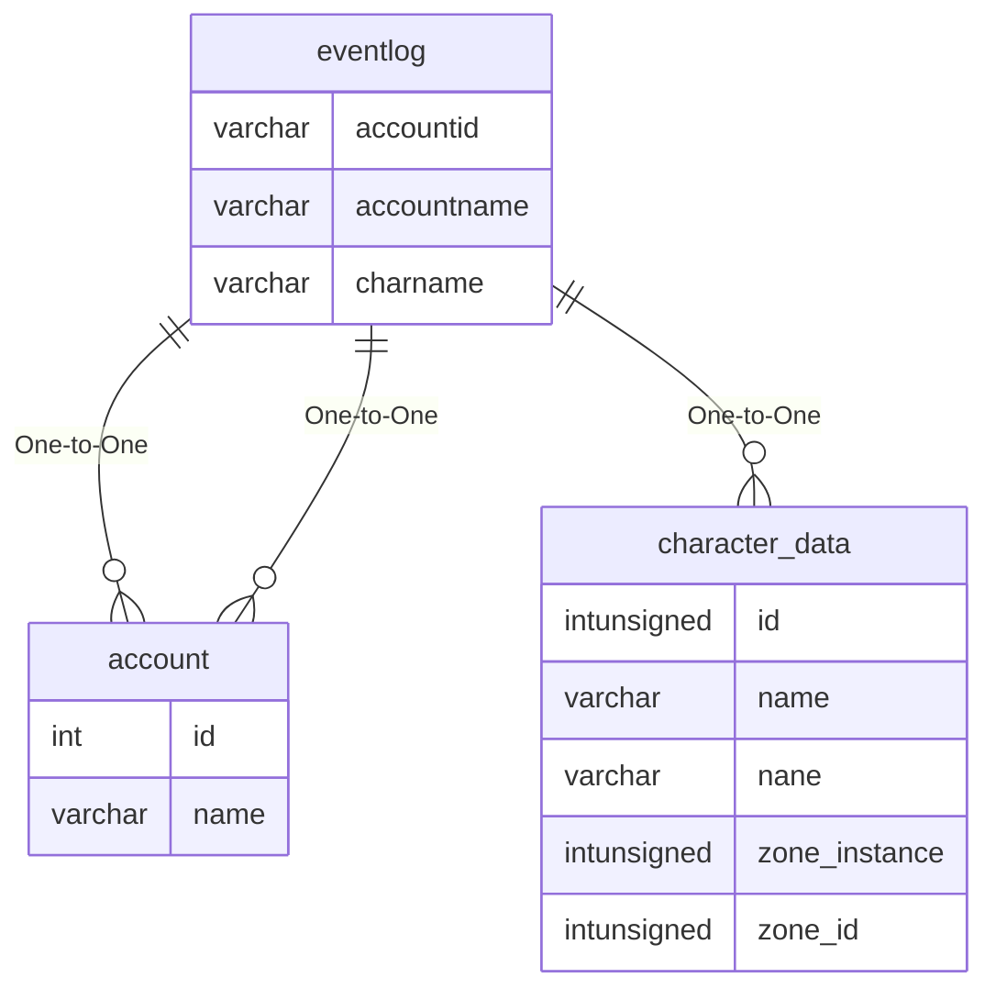

# eventlog

## Relationships

| Relationship Type | Local Key | Relates to Table | Foreign Key |
| :--- | :--- | :--- | :--- |
| One-to-One | accountid | [account](../../schema/account/account.md) | id |
| One-to-One | accountname | [account](../../schema/account/account.md) | name |
| One-to-One | charname | [character_data](../../schema/characters/character_data.md) | name |

## Schema

| Column | Data Type | Description |
| :--- | :--- | :--- |
| id | int | Unique Event Identifier |
| accountname | varchar | [Account Name](../../schema/account/account.md) |
| accountid | int | [Account Identifier](../../schema/account/account.md) |
| status | int | [Status](../../../../server/player/status-levels) |
| charname | varchar | [Character Name](../../schema/characters/character_data.md) |
| target | varchar | Target |
| time | timestamp | TIme Timestamp |
| descriptiontype | varchar | Description Type |
| description | text | Description |
| event_nid | int | Event Identifier |

