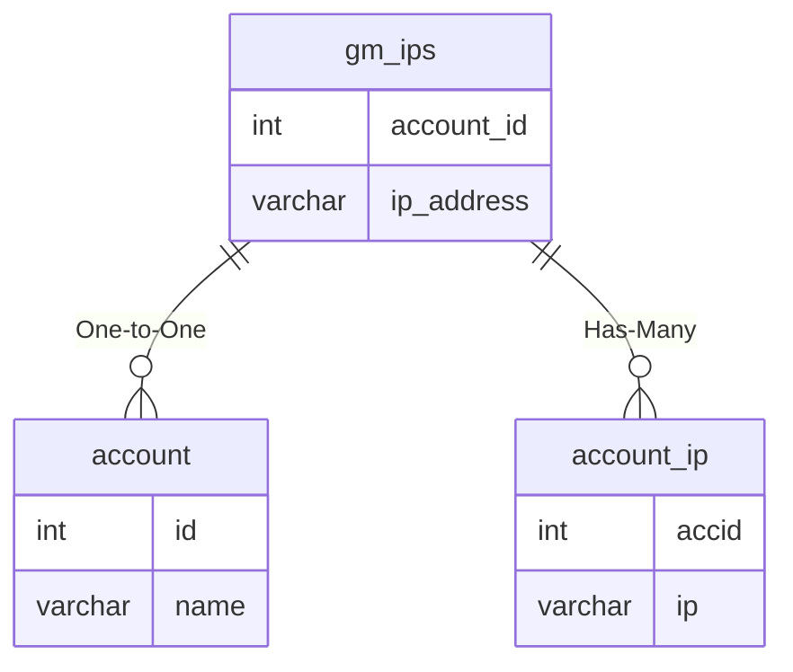

# gm_ips

## Relationships

| Relationship Type | Local Key | Relates to Table | Foreign Key |
| :--- | :--- | :--- | :--- |
| One-to-One | account_id | [account](../../schema/account/account.md) | id |
| Has-Many | ip_address | [account_ip](../../schema/account/account_ip.md) | ip |

## Schema

| Column | Data Type | Description |
| :--- | :--- | :--- |
| name | varchar | [Character Name](../../schema/characters/character_data.md) |
| account_id | int | [Account Identifier](../../schema/account/account.md) |
| ip_address | varchar | [IP Address](../../schema/account/account_ip.md) |

