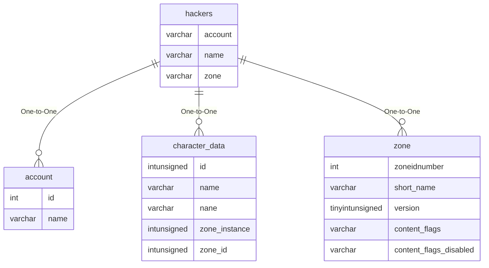

# hackers

## Relationships

| Relationship Type | Local Key | Relates to Table | Foreign Key |
| :--- | :--- | :--- | :--- |
| One-to-One | account | [account](../../schema/account/account.md) | name |
| One-to-One | name | [character_data](../../schema/characters/character_data.md) | name |
| One-to-One | zone | [zone](../../schema/zone/zone.md) | short_name |

## Schema

| Column | Data Type | Description |
| :--- | :--- | :--- |
| id | int | Unique Hacker Identifier |
| account | text | [Account Identifier](../../schema/account/account.md) |
| name | text | [Character Name](../../schema/characters/character_data.md) |
| hacked | text | Hacked |
| zone | text | [Zone Short Name](../../../../server/zones/zone-list) |
| date | timestamp | Date Timestamp |

