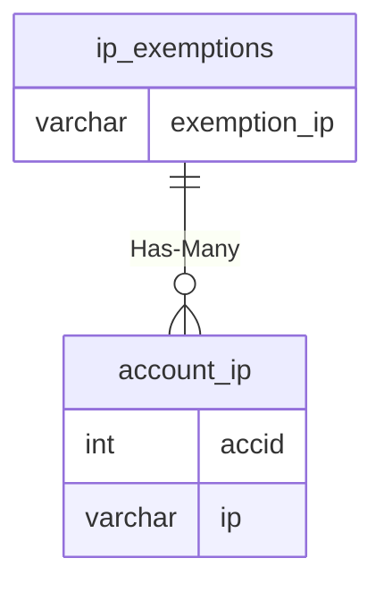

# ip_exemptions

!!! info
	This page was last generated 2024.02.07

## Relationship Diagram(s)

## Relationships

| Relationship Type | Local Key | Relates to Table | Foreign Key |
| :--- | :--- | :--- | :--- |
| Has-Many | exemption_ip | [account_ip](../../schema/account/account_ip.md) | ip |

## Schema

| Column | Data Type | Description |
| :--- | :--- | :--- |
| exemption_id | int | Exemption Identifier |
| exemption_ip | varchar | [Exemption IP Address](../../schema/account/account_ip.md) |
| exemption_amount | int | Exemption Amount |

