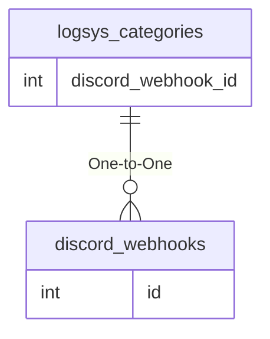

# logsys_categories

!!! info
	This page was last generated 2024.02.07

## Relationship Diagram(s)

## Relationships

| Relationship Type | Local Key | Relates to Table | Foreign Key |
| :--- | :--- | :--- | :--- |
| One-to-One | discord_webhook_id | [discord_webhooks](../../schema/admin/discord_webhooks.md) | id |

## Schema

| Column | Data Type | Description |
| :--- | :--- | :--- |
| log_category_id | int | Unique Log Category Identifier |
| log_category_description | varchar | Log Category Description |
| log_to_console | smallint | Log to Console: 0 = False, 1 = True |
| log_to_file | smallint | Log to File: 0 = False, 1 = True |
| log_to_gmsay | smallint | Log to GMSay: 0 = False, 1 = True |
| log_to_discord | smallint | Log To Discord: 0 = False, 1 = True |
| discord_webhook_id | int | Unique Webhook Identifier |

