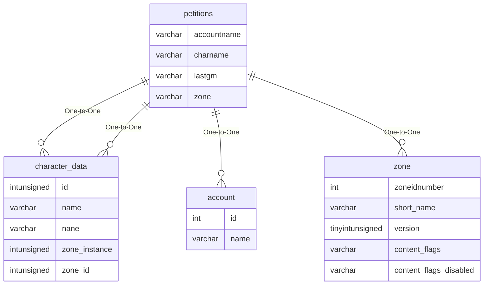

# petitions

## Relationships

| Relationship Type | Local Key | Relates to Table | Foreign Key |
| :--- | :--- | :--- | :--- |
| One-to-One | charname | [character_data](../../schema/characters/character_data.md) | name |
| One-to-One | accountname | [account](../../schema/account/account.md) | name |
| One-to-One | lastgm | [character_data](../../schema/characters/character_data.md) | name |
| One-to-One | zone | [zone](../../schema/zone/zone.md) | zoneidnumber |

## Schema

| Column | Data Type | Description |
| :--- | :--- | :--- |
| dib | int | Unknown |
| petid | int | Unique Petition Entry Identifier |
| charname | varchar | [Character Name](../../schema/characters/character_data.md) |
| accountname | varchar | [Account Name](../../schema/account/account.md) |
| lastgm | varchar | Last GM |
| petitiontext | text | Petition Text |
| gmtext | text | GM Text |
| zone | varchar | [Zone Short Name](../../../../server/zones/zone-list) |
| urgency | int | Urgency |
| charclass | int | [Character Class](../../../../server/player/class-list) |
| charrace | int | [Character Race](../../../../server/npc/race-list) |
| charlevel | int | Character Level |
| checkouts | int | Checkouts |
| unavailables | int | Unavailables |
| ischeckedout | tinyint | Is Checked Out: 0 = False, 1 = True |
| senttime | bigint | Sent Time UNIX Timestamp |

