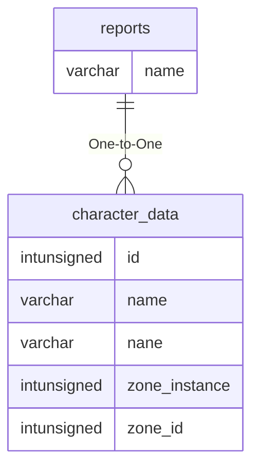

# reports

!!! info
	This page was last generated 2024.02.07

## Relationship Diagram(s)

## Relationships

| Relationship Type | Local Key | Relates to Table | Foreign Key |
| :--- | :--- | :--- | :--- |
| One-to-One | name | [character_data](../../schema/characters/character_data.md) | name |

## Schema

| Column | Data Type | Description |
| :--- | :--- | :--- |
| id | int | Unique Report Identifier |
| name | varchar | Name |
| reported | varchar | Reported |
| reported_text | text | Reported Text |

