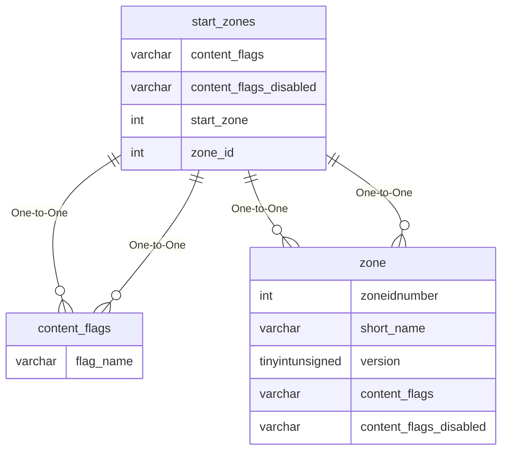

# start_zones

!!! info
	This page was last generated 2024.02.07

## Relationship Diagram(s)

## Relationships

| Relationship Type | Local Key | Relates to Table | Foreign Key |
| :--- | :--- | :--- | :--- |
| One-to-One | content_flags | [content_flags](../../schema/flagging/content_flags.md) | flag_name |
| One-to-One | content_flags_disabled | [content_flags](../../schema/flagging/content_flags.md) | flag_name |
| One-to-One | start_zone | [zone](../../schema/zone/zone.md) | zoneidnumber |
| One-to-One | zone_id | [zone](../../schema/zone/zone.md) | zoneidnumber |

## Schema

| Column | Data Type | Description |
| :--- | :--- | :--- |
| x | float | X Coordinate |
| y | float | Y Coordinate |
| z | float | Z Coordinate |
| heading | float | Heading Coordinate |
| zone_id | int | [Zone Identifier](../../../../server/zones/zone-list) |
| bind_id | int | Bind Identifier |
| player_choice | int | Player Choice |
| player_class | int | [Player Class](../../../../server/player/class-list) |
| player_deity | int | [Player Deity](../../../../server/player/deity-list) |
| player_race | int | [Player Race](../../../../server/npc/race-list) |
| start_zone | int | [Zone Identifier](../../../../server/zones/zone-list) |
| bind_x | float | Bind X Coordinate |
| bind_y | float | Bind Y Coordinate |
| bind_z | float | Bind Z Coordinate |
| select_rank | tinyint | Select Rank: Always 50 |
| min_expansion | tinyint | [Minimum Expansion](../../../../server/operation/expansion-list) |
| max_expansion | tinyint | [Maximum Expansion](../../../../server/operation/expansion-list) |
| content_flags | varchar | Content Flags Required to be Enabled |
| content_flags_disabled | varchar | Content Flags Required to be Disabled |

