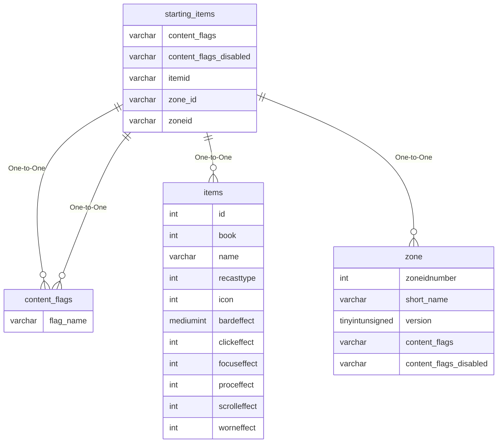

# starting_items

## Relationships

| Relationship Type | Local Key | Relates to Table | Foreign Key |
| :--- | :--- | :--- | :--- |
| One-to-One | content_flags | [content_flags](../../schema/flagging/content_flags.md) | flag_name |
| One-to-One | content_flags_disabled | [content_flags](../../schema/flagging/content_flags.md) | flag_name |
| One-to-One | itemid | [items](../../schema/items/items.md) | id |
| One-to-One | zone_id | [zone](../../schema/zone/zone.md) | zoneidnumber |

## Schema

| Column | Data Type | Description |
| :--- | :--- | :--- |
| id | int | Unique Starting Items Entry Identifier |
| class_list | text |  |
| class | int | [Class](../../../../server/player/class-list): 0 = All |
| deityid | int | [Deity](../../../../server/player/deity-list): 0 = Alll |
| zone_id_list | text |  |
| itemid | int | [Item Identifier](../../schema/items/items.md) |
| item_charges | tinyint | Item Charges |
| status | mediumint |  |
| slot | mediumint | [Slot](../../../../server/inventory/inventory-slots) |
| min_expansion | tinyint | [Minimum Expansion](../../../../server/operation/expansion-list) |
| max_expansion | tinyint | [Maximum Expansion](../../../../server/operation/expansion-list) |
| content_flags | varchar | Content Flags Required to be Enabled |
| content_flags_disabled | varchar | Content Flags Required to be Disabled |

