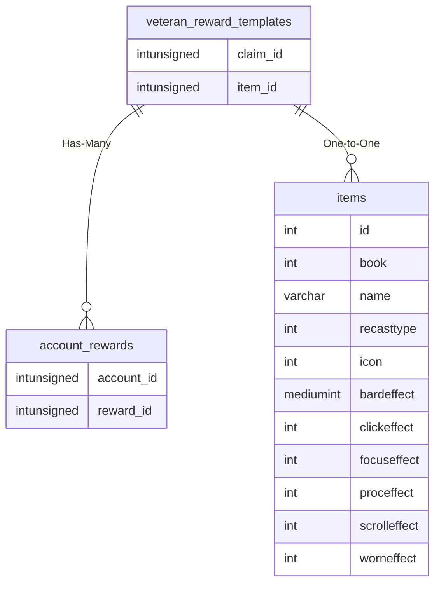

# veteran_reward_templates

## Relationships

| Relationship Type | Local Key | Relates to Table | Foreign Key |
| :--- | :--- | :--- | :--- |
| Has-Many | claim_id | [account_rewards](../../schema/account/account_rewards.md) | reward_id |
| One-to-One | item_id | [items](../../schema/items/items.md) | id |

## Schema

| Column | Data Type | Description |
| :--- | :--- | :--- |
| claim_id | int | Unique Claim Identifier |
| name | varchar | Name |
| item_id | int | [Item Identifier](../../schema/items/items.md) |
| charges | smallint | Charges |
| reward_slot | tinyint | Reward Slot |

