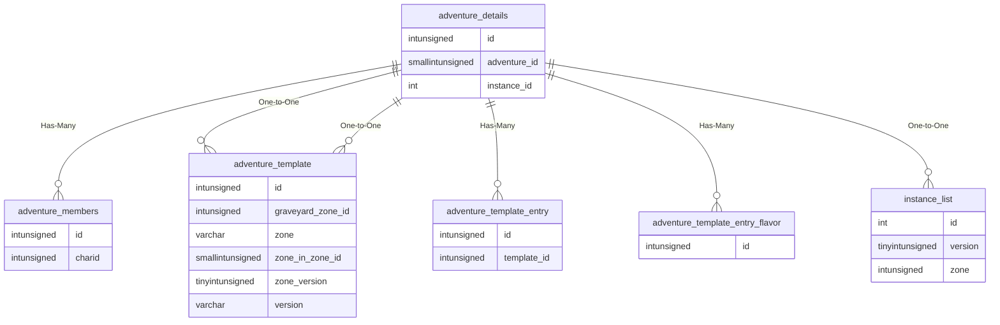

# adventure_details

## Relationships

| Relationship Type | Local Key | Relates to Table | Foreign Key |
| :--- | :--- | :--- | :--- |
| Has-Many | id | [adventure_members](../../schema/adventures/adventure_members.md) | id |
| One-to-One | id | [adventure_template](../../schema/adventures/adventure_template.md) | id |
| Has-Many | id | [adventure_template_entry](../../schema/adventures/adventure_template_entry.md) | id |
| Has-Many | id | [adventure_template_entry_flavor](../../schema/adventures/adventure_template_entry_flavor.md) | id |
| One-to-One | adventure_id | [adventure_template](../../schema/adventures/adventure_template.md) | id |
| One-to-One | instance_id | [instance_list](../../schema/instances/instance_list.md) | id |

## Schema

| Column | Data Type | Description |
| :--- | :--- | :--- |
| id | int | Unique Entry Identifier |
| adventure_id | smallint | Unique Adventure Identifier |
| instance_id | int | [Instance Identifier](../../schema/instances/instance_list.md) |
| count | smallint | Count |
| assassinate_count | smallint | Assassinate Count |
| status | tinyint | Status |
| time_created | int | Time Created UNIX Timestamp |
| time_zoned | int | Time Zoned UNIX Timestamp |
| time_completed | int | Time Completed UNIX Timestamp |

