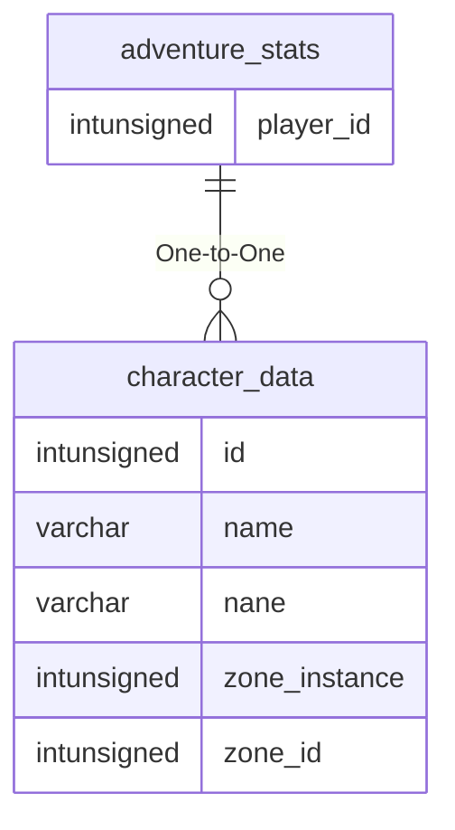

# adventure_stats

## Relationships

| Relationship Type | Local Key | Relates to Table | Foreign Key |
| :--- | :--- | :--- | :--- |
| One-to-One | player_id | [character_data](../../schema/characters/character_data.md) | id |

## Schema

| Column | Data Type | Description |
| :--- | :--- | :--- |
| player_id | int | [Character Identifier](../../schema/characters/character_data.md) |
| guk_wins | mediumint | Deepest Guk Wins |
| mir_wins | mediumint | Miragul's Menagerie Wins |
| mmc_wins | mediumint | Mistmoore Catacombs Wins |
| ruj_wins | mediumint | Rujarkian Hills Wins |
| tak_wins | mediumint | Takish-Hiz Wins |
| guk_losses | mediumint | Deepest Guk Losses |
| mir_losses | mediumint | Miragul's Menagerie Losses |
| mmc_losses | mediumint | Mistmoore Catacombs Losses |
| ruj_losses | mediumint | Rujarkian Hills Losses |
| tak_losses | mediumint | Takish-Hiz Losses |

