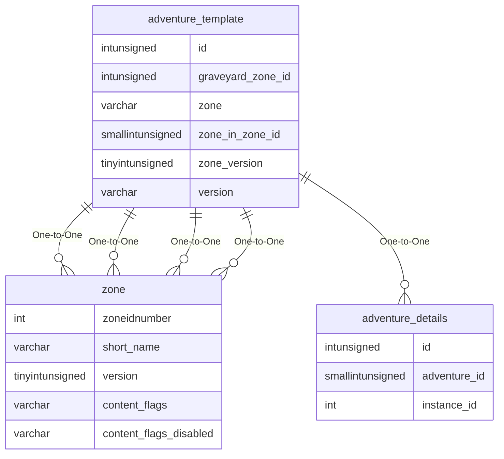

# adventure_template

## Relationships

| Relationship Type | Local Key | Relates to Table | Foreign Key |
| :--- | :--- | :--- | :--- |
| One-to-One | graveyard_zone_id | [zone](../../schema/zone/zone.md) | zoneidnumber |
| One-to-One | id | [adventure_details](../../schema/adventures/adventure_details.md) | id |
| One-to-One | zone | [zone](../../schema/zone/zone.md) | short_name |
| One-to-One | zone_in_zone_id | [zone](../../schema/zone/zone.md) | zoneidnumber |
| One-to-One | zone_version | [zone](../../schema/zone/zone.md) | version |

## Schema

| Column | Data Type | Description |
| :--- | :--- | :--- |
| id | int | [Adventure Identifier](adventure_details.md) |
| zone | varchar | [Zone Short Name](../../../../server/zones/zone-list) |
| zone_version | tinyint | Zone Version |
| is_hard | tinyint | Hard: 0 = False, 1 = True |
| is_raid | tinyint | Raid: 0 = False, 1 = True |
| min_level | tinyint | Minimum Level |
| max_level | tinyint | Maximum Level |
| type | tinyint | Type |
| type_data | int | Type Data |
| type_count | smallint | Type Count |
| assa_x | float | Assassination X Coordinate |
| assa_y | float | Assassination Y Coordinate |
| assa_z | float | Assassination Z Coordinate |
| assa_h | float | Assassination Heading Coordinate |
| text | varchar | Text |
| duration | int | Duration |
| zone_in_time | int | Zone In Duration |
| win_points | smallint | LDoN Points for Winning |
| lose_points | smallint | LDoN Points for Losing |
| theme | tinyint | [LDoN Theme](../../../../server/zones/ldon-themes) |
| zone_in_zone_id | smallint | [Zone In Zone Identifier](../../../../server/zones/zone-list) |
| zone_in_x | float | Zone In X Coordinate |
| zone_in_y | float | Zone In Y Coordinate |
| zone_in_object_id | smallint | Zone In Object Identifier |
| dest_x | float | Destination X Coordinate |
| dest_y | float | Destination Y Coordinate |
| dest_z | float | Destination Z Coordinate |
| dest_h | float | Destination Heading Coordinate |
| graveyard_zone_id | int | [Zone Identifier](../../../../server/zones/zone-list) |
| graveyard_x | float | Graveyard X Coordinate |
| graveyard_y | float | Graveyard Y Coordinate |
| graveyard_z | float | Graveyard Z Coordinate |
| graveyard_radius | float | Graveyard Radius |

