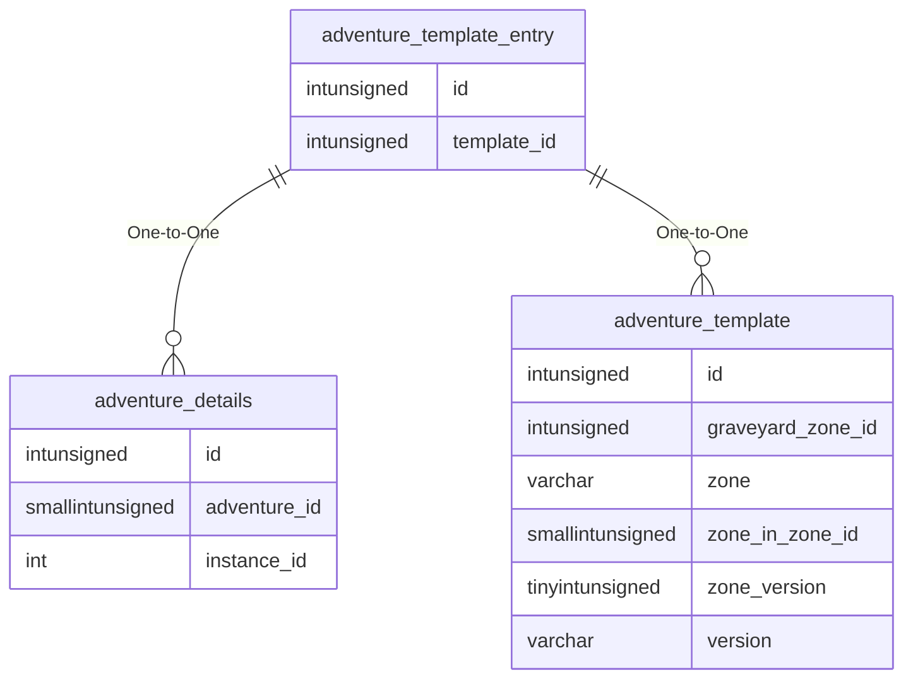

# adventure_template_entry

## Relationships

| Relationship Type | Local Key | Relates to Table | Foreign Key |
| :--- | :--- | :--- | :--- |
| One-to-One | id | [adventure_details](../../schema/adventures/adventure_details.md) | id |
| One-to-One | template_id | [adventure_template](../../schema/adventures/adventure_template.md) | id |

## Schema

| Column | Data Type | Description |
| :--- | :--- | :--- |
| id | int | [Adventure Identifier](adventure_details.md) |
| template_id | int | [Template Identifier](adventure_template.md) |

