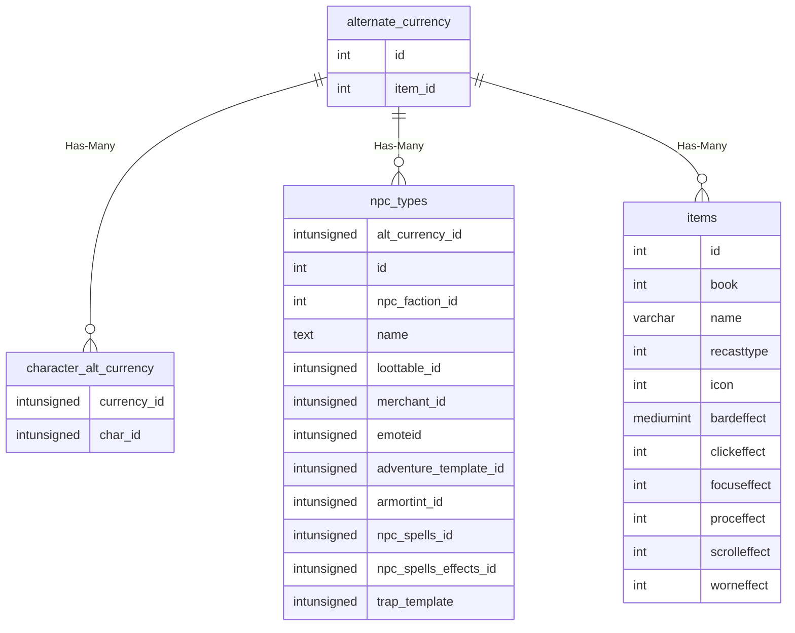

# alternate_currency

!!! info
	This page was last generated 2024.02.07

## Relationship Diagram(s)

## Relationships

| Relationship Type | Local Key | Relates to Table | Foreign Key |
| :--- | :--- | :--- | :--- |
| Has-Many | id | [character_alt_currency](../../schema/characters/character_alt_currency.md) | currency_id |
| Has-Many | id | [npc_types](../../schema/npcs/npc_types.md) | alt_currency_id |
| Has-Many | item_id | [items](../../schema/items/items.md) | id |

## Schema

| Column | Data Type | Description |
| :--- | :--- | :--- |
| id | int | [Alternate Currency Identifier](../../../../server/items/alternate-currencies) |
| item_id | int | [Item Identifier](../../schema/items/items.md) |

