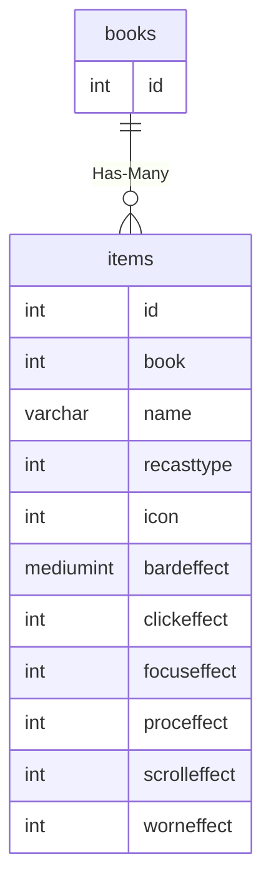

# books

!!! info
	This page was last generated 2024.02.07

## Relationship Diagram(s)




## Relationships

| Relationship Type | Local Key | Relates to Table | Foreign Key |
| :--- | :--- | :--- | :--- |
| Has-Many | id | [items](../../schema/items/items.md) | book |


## Schema

| Column | Data Type | Description |
| :--- | :--- | :--- |
| id | int | Book Identifier |
| name | varchar | Unique Book Identifier |
| txtfile | text | The text in the book. ` Represents line spaces, `` is two line spaces, ``` is three line spaces, etc. (13 lines per book page) |
| language | int | [Language](../../../../server/player/languages) |

