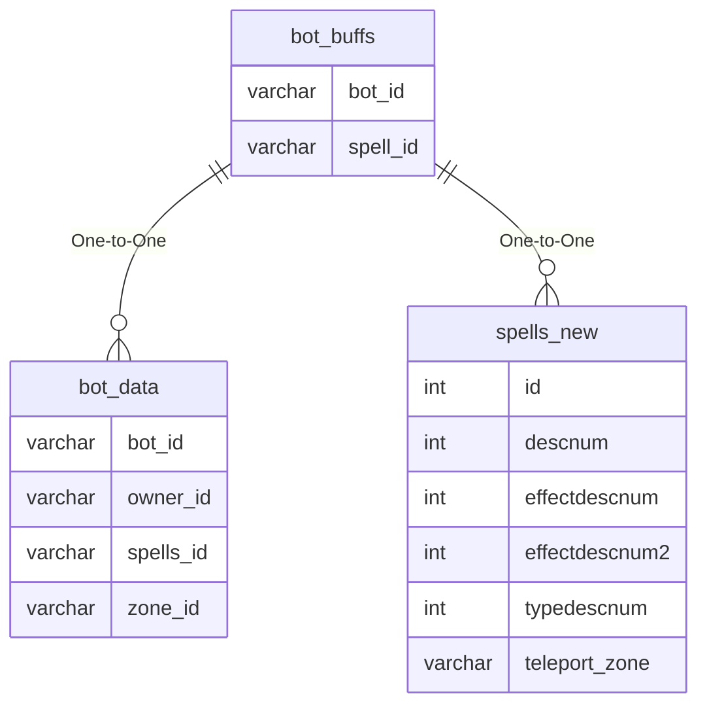

# bot_buffs

## Relationships

| Relationship Type | Local Key | Relates to Table | Foreign Key |
| :--- | :--- | :--- | :--- |
| One-to-One | bot_id | [bot_data](../../schema/bots/bot_data.md) | bot_id |
| One-to-One | spell_id | [spells_new](../../schema/spells/spells_new.md) | id |

## Schema

| Column | Data Type | Description |
| :--- | :--- | :--- |
| buffs_index | int | Unique Entry Identifier |
| bot_id | int | [Bot Identifier](bot_data.md) |
| spell_id | int | [Spell Identifier](../../schema/spells/spells_new.md) |
| caster_level | tinyint | Caster level |
| duration_formula | int | Duration Formula |
| tics_remaining | int | Tics Remaining |
| poison_counters | int | Poison Counter |
| disease_counters | int | Disease Counter |
| curse_counters | int | Curse Counter |
| corruption_counters | int | Corruption Counter |
| numhits | int | Number of Hits |
| melee_rune | int | Melee Rune |
| magic_rune | int | Magic Rune |
| dot_rune | int | Damage Over Time Rune |
| persistent | tinyint | Persistent: 0 = False, 1 = True |
| caston_x | int | X Coordinate |
| caston_y | int | Y Coordinate |
| caston_z | int | Z Coordinate |
| extra_di_chance | int | Extra DI Chance |
| instrument_mod | int | Instrument Modifier |

