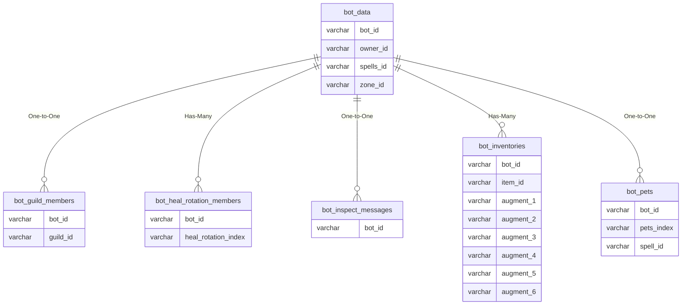
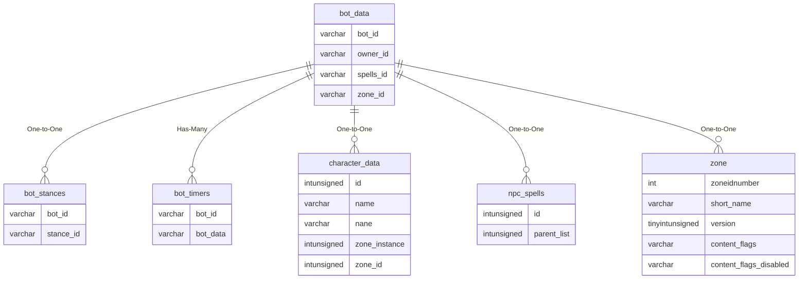

# bot_data

!!! info
	This page was last generated 2024.02.07

## Relationship Diagram(s)

## Relationships

| Relationship Type | Local Key | Relates to Table | Foreign Key |
| :--- | :--- | :--- | :--- |
| One-to-One | bot_id | [bot_guild_members](../../schema/bots/bot_guild_members.md) | bot_id |
| Has-Many | bot_id | [bot_heal_rotation_members](../../schema/bots/bot_heal_rotation_members.md) | bot_id |
| One-to-One | bot_id | [bot_inspect_messages](../../schema/bots/bot_inspect_messages.md) | bot_id |
| Has-Many | bot_id | [bot_inventories](../../schema/bots/bot_inventories.md) | bot_id |
| One-to-One | bot_id | [bot_pets](../../schema/bots/bot_pets.md) | bot_id |
| One-to-One | bot_id | [bot_stances](../../schema/bots/bot_stances.md) | bot_id |
| Has-Many | bot_id | [bot_timers](../../schema/bots/bot_timers.md) | bot_id |
| One-to-One | owner_id | [character_data](../../schema/characters/character_data.md) | id |
| One-to-One | spells_id | [npc_spells](../../schema/npcs/npc_spells.md) | id |
| One-to-One | zone_id | [zone](../../schema/zone/zone.md) | zoneidnumber |

## Schema

| Column | Data Type | Description |
| :--- | :--- | :--- |
| bot_id | int | Unique Bot Identifier |
| owner_id | int | [Owner Character Identifier](../../schema/characters/character_data.md) |
| spells_id | int | [Bot Spell List Identifier](../../../../categories/spells/bot-spell-list-ids) |
| name | varchar | Name |
| last_name | varchar | Last Name |
| title | varchar | Title |
| suffix | varchar | Suffix |
| zone_id | smallint | [Zone Identifier](../../../../server/zones/zone-list) |
| gender | tinyint | [Gender](../../../../server/npc/genders) |
| race | smallint | [Race](../../../../categories/npc/race-list) |
| class | tinyint | [Class](../../../../server/player/class-list) |
| level | tinyint | Level |
| deity | int | [Deity](../../../../categories/player/deity-list) |
| creation_day | int | UNIX Timestamp of creation date |
| last_spawn | int | UNIX Timestamp of last spawn_conditions |
| time_spawned | int | Time spawned |
| size | float | Size |
| face | int | Face |
| hair_color | int | Hair Color |
| hair_style | int | Hair Style |
| beard | int | Beard |
| beard_color | int | Beard Color |
| eye_color_1 | int | Eye Color 1 |
| eye_color_2 | int | Eye Color 2 |
| drakkin_heritage | int | Drakkin Heritage |
| drakkin_tattoo | int | Drakkin Tattoo |
| drakkin_details | int | Drakkin Details |
| ac | smallint | Armor Class |
| atk | mediumint | Attack |
| hp | int | Health |
| mana | int | Mana |
| str | mediumint | Strength |
| sta | mediumint | Stamina |
| cha | mediumint | Charisma |
| dex | mediumint | Dexterity |
| int | mediumint | Intelligence |
| agi | mediumint | Agility |
| wis | mediumint | Wisdom |
| fire | smallint | Fire Resistance |
| cold | smallint | Cold Resistance |
| magic | smallint | Magic Resistance |
| poison | smallint | Poison Resistance |
| disease | smallint | Disease Resistance |
| corruption | smallint | Corruption Resistance |
| show_helm | int | Show Helm: 0 = False, 1= True |
| follow_distance | int | Follow Distance |
| stop_melee_level | tinyint | Stop Melee Level |
| expansion_bitmask | int | [Expansion Bitmask](../../../../categories/operation/expansion-list) |
| enforce_spell_settings | tinyint | Enforce Spell Settings: 0 = False, 1 = True |
| archery_setting | tinyint | Archery Setting: 0 = False, 1 = True |
| caster_range | int | Caster Range |

