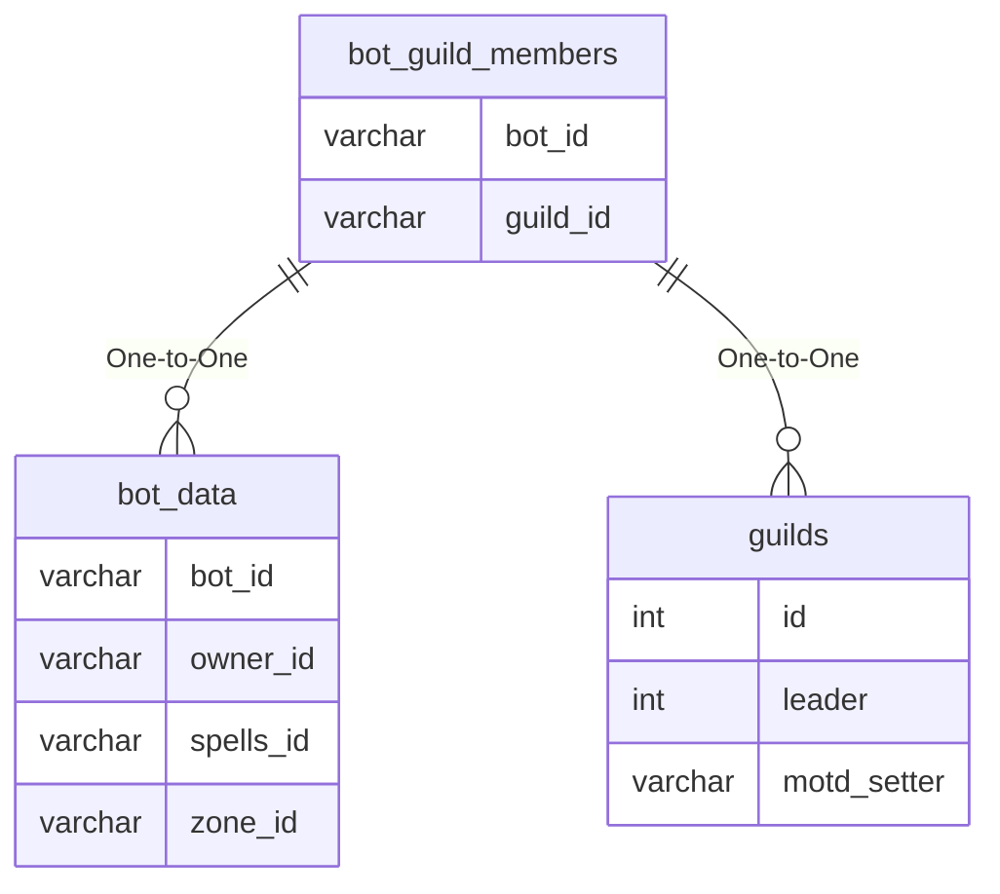

# bot_guild_members

## Relationships

| Relationship Type | Local Key | Relates to Table | Foreign Key |
| :--- | :--- | :--- | :--- |
| One-to-One | bot_id | [bot_data](../../schema/bots/bot_data.md) | bot_id |
| One-to-One | guild_id | [guilds](../../schema/guilds/guilds.md) | id |

## Schema

| Column | Data Type | Description |
| :--- | :--- | :--- |
| bot_id | int | [Bot Identifier](bot_data.md) |
| guild_id | mediumint | [Guild Identifier](../../schema/guilds/guilds.md) |
| rank | tinyint | [Guild Rank](../../../../categories/player/guild-ranks) |
| tribute_enable | tinyint | Tribute Enabled: 0 = False, 1= True |
| total_tribute | int | Total Tribute |
| last_tribute | int | Last Tribute |
| banker | tinyint | Banker: 0 = False, 1 = True |
| public_note | text | Public Note |
| alt | tinyint | Alt: 0 = False, 1 = True |

