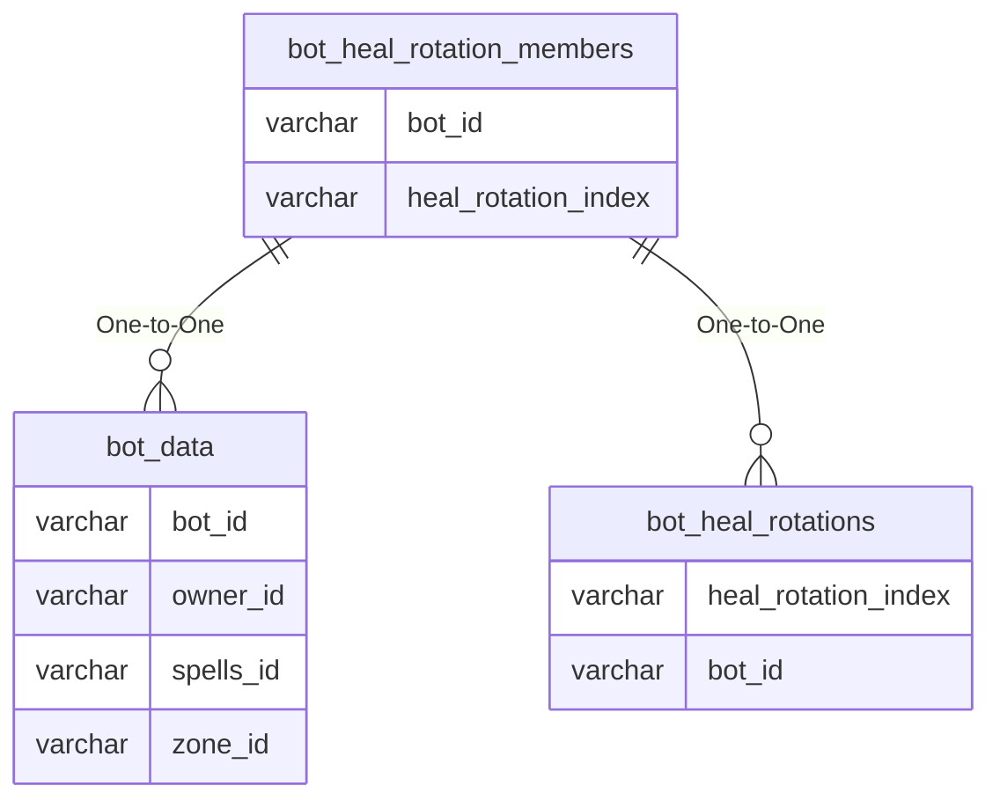

# bot_heal_rotation_members

## Relationships

| Relationship Type | Local Key | Relates to Table | Foreign Key |
| :--- | :--- | :--- | :--- |
| One-to-One | bot_id | [bot_data](../../schema/bots/bot_data.md) | bot_id |
| One-to-One | heal_rotation_index | [bot_heal_rotations](../../schema/bots/bot_heal_rotations.md) | heal_rotation_index |

## Schema

| Column | Data Type | Description |
| :--- | :--- | :--- |
| member_index | int | Unique Bot Heal Rotation Member Identifier |
| heal_rotation_index | int | [Heal Rotation Identifier](bot_heal_rotations.md) |
| bot_id | int | [Bot Identifier](bot_data.md) |

