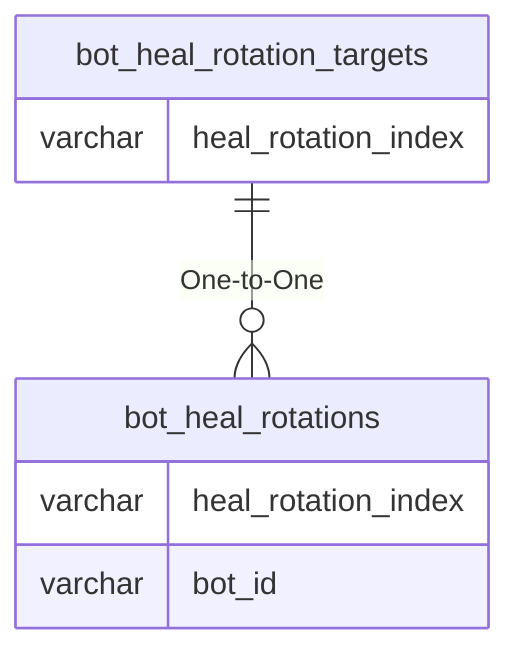

# bot_heal_rotation_targets

!!! info
	This page was last generated 2024.02.07

## Relationship Diagram(s)

## Relationships

| Relationship Type | Local Key | Relates to Table | Foreign Key |
| :--- | :--- | :--- | :--- |
| One-to-One | heal_rotation_index | [bot_heal_rotations](../../schema/bots/bot_heal_rotations.md) | heal_rotation_index |

## Schema

| Column | Data Type | Description |
| :--- | :--- | :--- |
| target_index | int | Unique Bot Heal Rotation Target Identifier |
| heal_rotation_index | int | [Heal Rotation Identifier](bot_heal_rotations.md) |
| target_name | varchar | Target Name |

