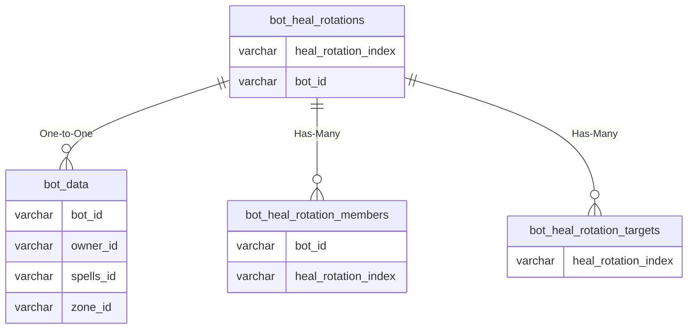

# bot_heal_rotations

!!! info
	This page was last generated 2024.02.07

## Relationship Diagram(s)

## Relationships

| Relationship Type | Local Key | Relates to Table | Foreign Key |
| :--- | :--- | :--- | :--- |
| One-to-One | bot_id | [bot_data](../../schema/bots/bot_data.md) | bot_id |
| Has-Many | heal_rotation_index | [bot_heal_rotation_members](../../schema/bots/bot_heal_rotation_members.md) | heal_rotation_index |
| Has-Many | heal_rotation_index | [bot_heal_rotation_targets](../../schema/bots/bot_heal_rotation_targets.md) | heal_rotation_index |

## Schema

| Column | Data Type | Description |
| :--- | :--- | :--- |
| heal_rotation_index | int | Unique Heal Rotation Identifier |
| bot_id | int | [Bot Identifier](bot_data.md) |
| interval | int | Interval |
| fast_heals | int | Fast Heals |
| adaptive_targeting | int | Adaptive Targeting |
| casting_override | int | Casting Override |
| safe_hp_base | float | Safe Health Base |
| safe_hp_cloth | float | Safe Health Cloth |
| safe_hp_leather | float | Safe Health Leather |
| safe_hp_chain | float | Safe Health Chain |
| safe_hp_plate | float | Safe Health Plate |
| critical_hp_base | float | Critical Health Base |
| critical_hp_cloth | float | Critical Health Cloth |
| critical_hp_leather | float | Critical Health Leather |
| critical_hp_chain | float | Critical Health Chain |
| critical_hp_plate | float | Critical Health Plate |

