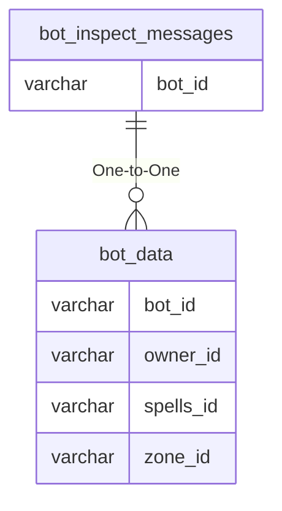

# bot_inspect_messages

## Relationships

| Relationship Type | Local Key | Relates to Table | Foreign Key |
| :--- | :--- | :--- | :--- |
| One-to-One | bot_id | [bot_data](../../schema/bots/bot_data.md) | bot_id |

## Schema

| Column | Data Type | Description |
| :--- | :--- | :--- |
| bot_id | int | [Bot Identifier](bot_data.md) |
| inspect_message | varchar | Inspect Message |

