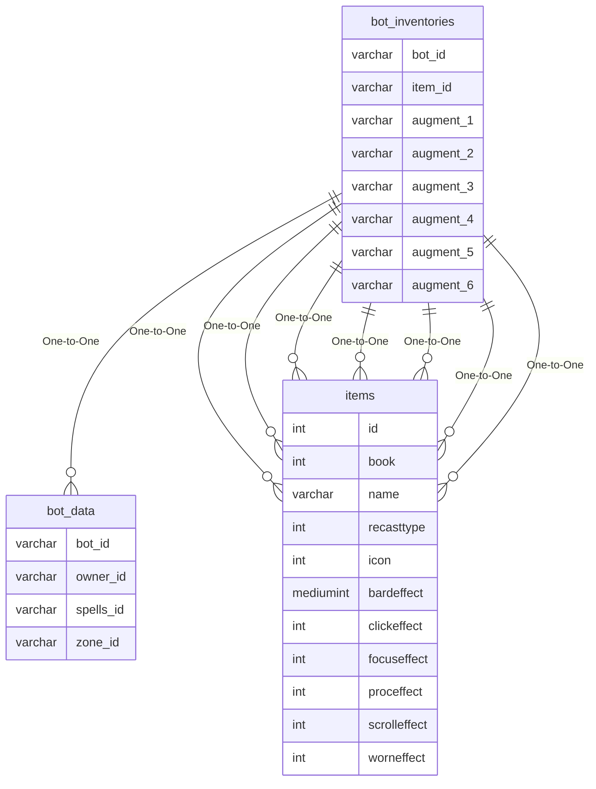

# bot_inventories

!!! info
	This page was last generated 2024.02.07

## Relationship Diagram(s)

## Relationships

| Relationship Type | Local Key | Relates to Table | Foreign Key |
| :--- | :--- | :--- | :--- |
| One-to-One | bot_id | [bot_data](../../schema/bots/bot_data.md) | bot_id |
| One-to-One | item_id | [items](../../schema/items/items.md) | id |
| One-to-One | augment_1 | [items](../../schema/items/items.md) | id |
| One-to-One | augment_2 | [items](../../schema/items/items.md) | id |
| One-to-One | augment_3 | [items](../../schema/items/items.md) | id |
| One-to-One | augment_4 | [items](../../schema/items/items.md) | id |
| One-to-One | augment_5 | [items](../../schema/items/items.md) | id |
| One-to-One | augment_6 | [items](../../schema/items/items.md) | id |

## Schema

| Column | Data Type | Description |
| :--- | :--- | :--- |
| inventories_index | int | Unique Bot Inventory Identifier |
| bot_id | int | [Bot Identifier](bot_data.md) |
| slot_id | mediumint | [Slot Identifier](../../../../categories/inventory/inventory-slots) |
| item_id | int | [Item Identifier](../items/items.md) |
| inst_charges | smallint | Charges |
| inst_color | int | Color |
| inst_no_drop | tinyint | No Drop: 0 = False, 1=  True |
| inst_custom_data | text | Custom Data |
| ornament_icon | int | Ornamentation Icon |
| ornament_id_file | int | Ornamentation Item Texture |
| ornament_hero_model | int | Ornamentation Hero's Forge Model |
| augment_1 | mediumint | Augment Slot 1 |
| augment_2 | mediumint | Augment Slot 2 |
| augment_3 | mediumint | Augment Slot 3 |
| augment_4 | mediumint | Augment Slot 4 |
| augment_5 | mediumint | Augment Slot 5 |
| augment_6 | mediumint | Augment Slot 6 |

