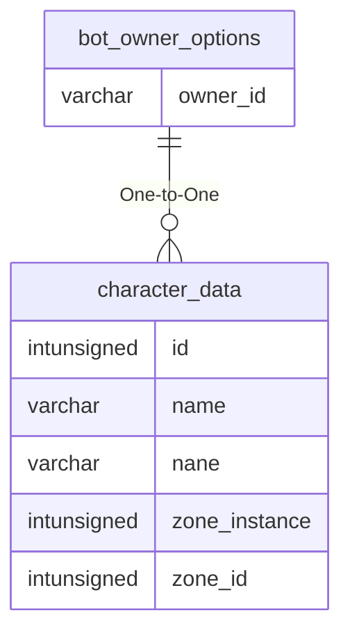

# bot_owner_options

## Relationships

| Relationship Type | Local Key | Relates to Table | Foreign Key |
| :--- | :--- | :--- | :--- |
| One-to-One | owner_id | [character_data](../../schema/characters/character_data.md) | id |

## Schema

| Column | Data Type | Description |
| :--- | :--- | :--- |
| owner_id | int | [Owner Character Identifier](../../schema/characters/character_data.md) |
| option_type | smallint | Option Type |
| option_value | smallint | Option Value |

