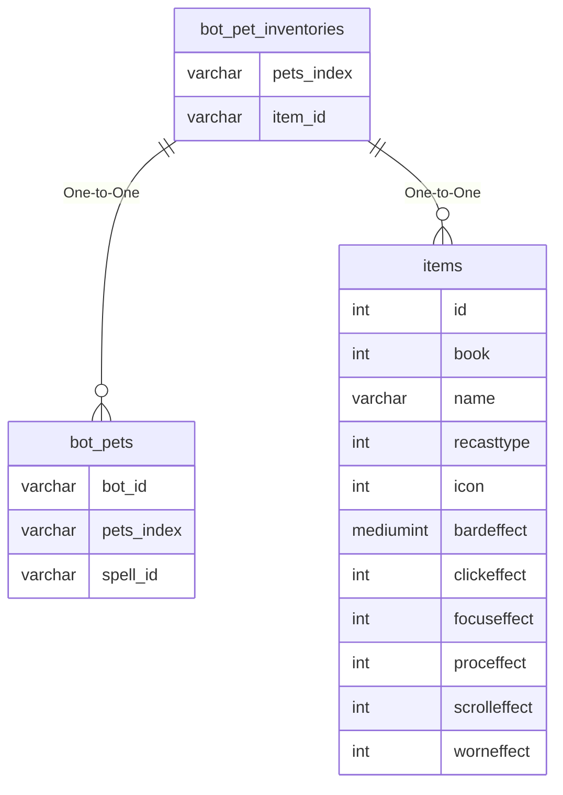

# bot_pet_inventories

!!! info
	This page was last generated 2024.02.07

## Relationship Diagram(s)

## Relationships

| Relationship Type | Local Key | Relates to Table | Foreign Key |
| :--- | :--- | :--- | :--- |
| One-to-One | pets_index | [bot_pets](../../schema/bots/bot_pets.md) | pets_index |
| One-to-One | item_id | [items](../../schema/items/items.md) | id |

## Schema

| Column | Data Type | Description |
| :--- | :--- | :--- |
| pet_inventories_index | int | Unique Bot Pet Inventory Identifier |
| pets_index | int | [Bot Pet Identifier](bot_pets.md) |
| item_id | int | [Item Identifier](../../schema/items/items.md) |

