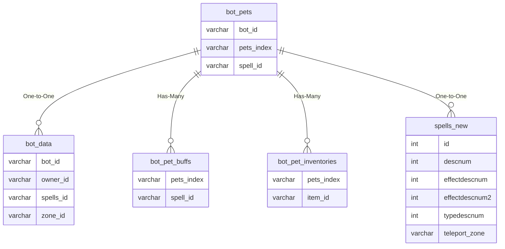

# bot_pets

!!! info
	This page was last generated 2024.02.07

## Relationship Diagram(s)

## Relationships

| Relationship Type | Local Key | Relates to Table | Foreign Key |
| :--- | :--- | :--- | :--- |
| One-to-One | bot_id | [bot_data](../../schema/bots/bot_data.md) | bot_id |
| Has-Many | pets_index | [bot_pet_buffs](../../schema/bots/bot_pet_buffs.md) | pets_index |
| Has-Many | pets_index | [bot_pet_inventories](../../schema/bots/bot_pet_inventories.md) | pets_index |
| One-to-One | spell_id | [spells_new](../../schema/spells/spells_new.md) | id |

## Schema

| Column | Data Type | Description |
| :--- | :--- | :--- |
| pets_index | int | Unique Bot Pet Identifier |
| spell_id | int | [Spell Identifier](../../schema/spells/spells_new.md) |
| bot_id | int | [Bot Identifier](bot_data.md) |
| name | varchar | Name |
| mana | int | Mana |
| hp | int | Health |

