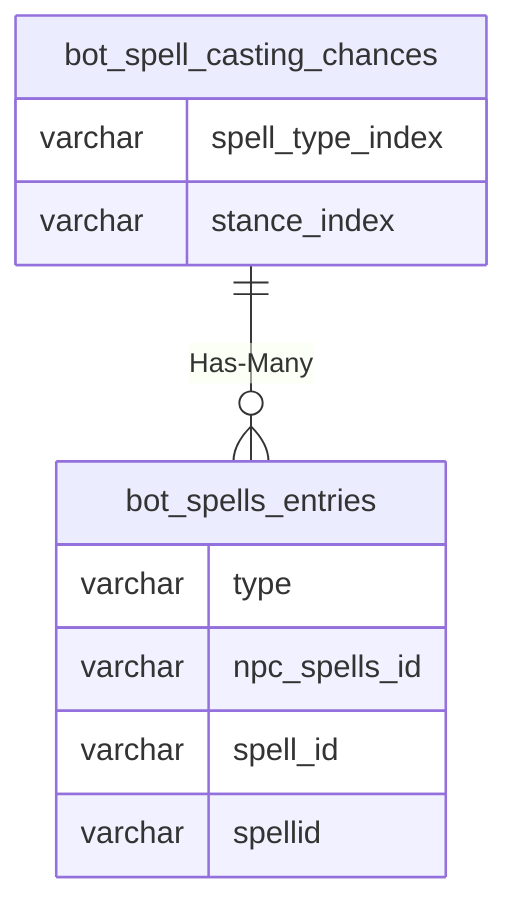

# bot_spell_casting_chances

!!! info
	This page was last generated 2024.02.07

## Relationship Diagram(s)

## Relationships

| Relationship Type | Local Key | Relates to Table | Foreign Key |
| :--- | :--- | :--- | :--- |
| Has-Many | spell_type_index | [bot_spells_entries](../../schema/bots/bot_spells_entries.md) | type |

## Schema

| Column | Data Type | Description |
| :--- | :--- | :--- |
| id | int | Unique Bot Spell Casting Chance Identifier |
| spell_type_index | tinyint | [Spell Type Identifier](../../../../categories/spells/spell-types) |
| class_id | tinyint | [Class Identifier](../../../../server/player/class-list) |
| stance_index | tinyint | [Stance Type Identifier](../../../../categories/bots/stance-types) |
| nHSND_value | tinyint | Negative Healer/Slower/Nuker/Doter Value |
| pH_value | tinyint | Positive Healer Value |
| pS_value | tinyint | Positive Slower Value |
| pHS_value | tinyint | Positive Healer/Slower Value |
| pN_value | tinyint | Positive Nuker Value |
| pHN_value | tinyint | Positive Healer/Nuker Value |
| pSN_value | tinyint | Positive Slower/Nuker Value |
| pHSN_value | tinyint | Positive Healer/Slower/Nuker Value |
| pD_value | tinyint | Positive Doter Value |
| pHD_value | tinyint | Positive Healer/Doter Value |
| pSD_value | tinyint | Positive Slower/Doter Value |
| pHSD_value | tinyint | Positive Healer/Slower/Doter Value |
| pND_value | tinyint | Positive Nuker/Doter Value |
| pHND_value | tinyint | Positive Healer/Nuker/Doter Value |
| pSND_value | tinyint | Positive Slower/Nuker/Doter Value |
| pHSND_value | tinyint | Positive Healer/Slower/Nuker/Doter Value |

