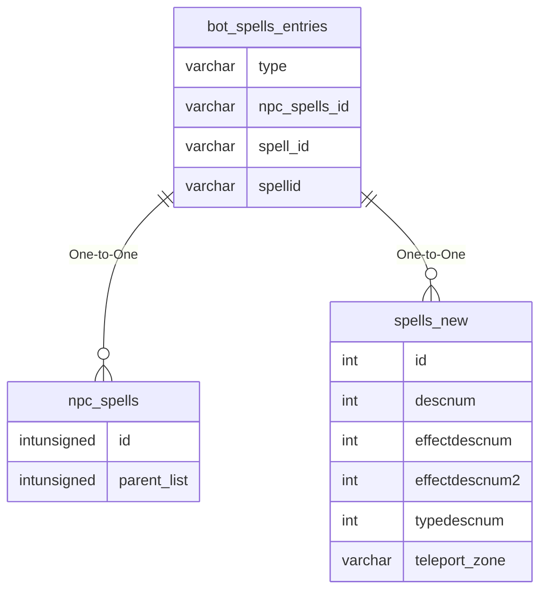

# bot_spells_entries

## Relationships

| Relationship Type | Local Key | Relates to Table | Foreign Key |
| :--- | :--- | :--- | :--- |
| One-to-One | npc_spells_id | [npc_spells](../../schema/npcs/npc_spells.md) | id |
| One-to-One | spell_id | [spells_new](../../schema/spells/spells_new.md) | id |

## Schema

| Column | Data Type | Description |
| :--- | :--- | :--- |
| id | int | Unique Bot Spell Entry Identifier |
| npc_spells_id | int | [Bot Spell List Identifier](../../../../categories/spells/bot-spell-list-ids) |
| spellid | smallint | [Spell Identifier](../../schema/spells/spells_new.md) |
| type | int | [Spell Type](../../../../categories/spells/spell-types) |
| minlevel | tinyint | Minimum Level |
| maxlevel | tinyint | Maximum Level |
| manacost | smallint | Mana Cost |
| recast_delay | int | Recast Delay |
| priority | smallint | Bot Spell Priority: Lower is better |
| resist_adjust | int | Resist Adjustment |
| min_hp | smallint | Minimum Health Percentage |
| max_hp | smallint | Maximum Health Percentage |
| bucket_name | varchar | Bucket Name |
| bucket_value | varchar | Bucket Value |
| bucket_comparison | tinyint | [Bucket Comparison](../../../../server/scripting/merchant-data-buckets) |

