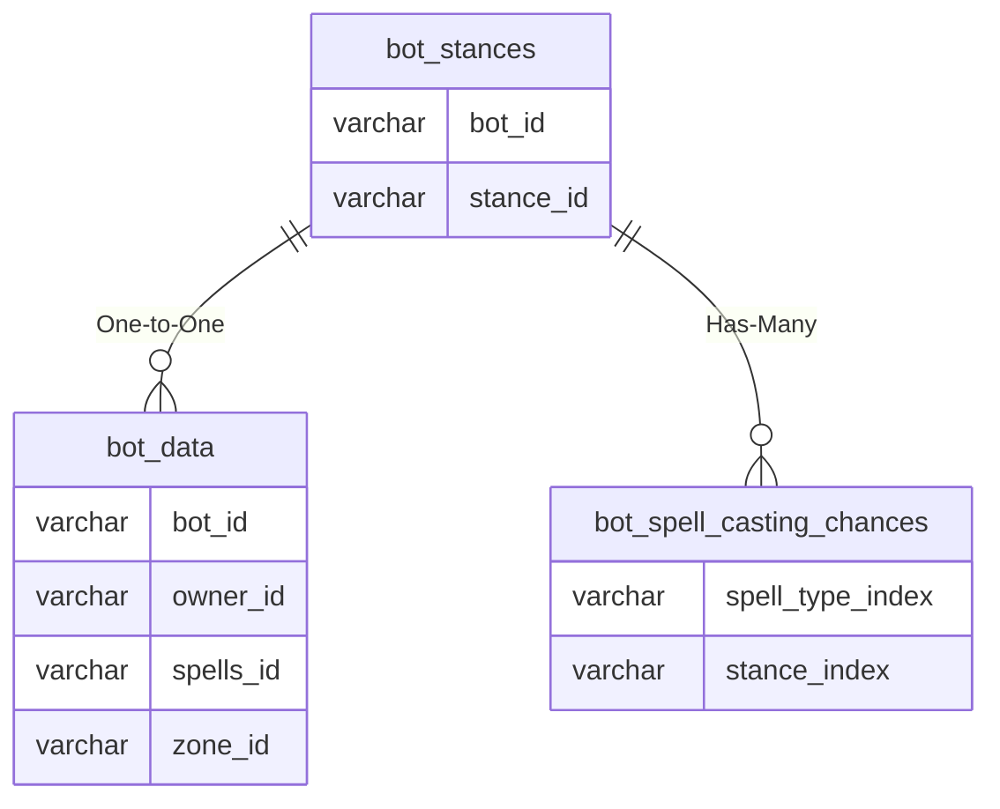

# bot_stances

## Relationships

| Relationship Type | Local Key | Relates to Table | Foreign Key |
| :--- | :--- | :--- | :--- |
| One-to-One | bot_id | [bot_data](../../schema/bots/bot_data.md) | bot_id |
| Has-Many | stance_id | [bot_spell_casting_chances](../../schema/bots/bot_spell_casting_chances.md) | stance_index |

## Schema

| Column | Data Type | Description |
| :--- | :--- | :--- |
| bot_id | int | [Bot Identifier](bot_data.md) |
| stance_id | tinyint | [Stance Identifier](../../../../server/bots/stance-types) |

