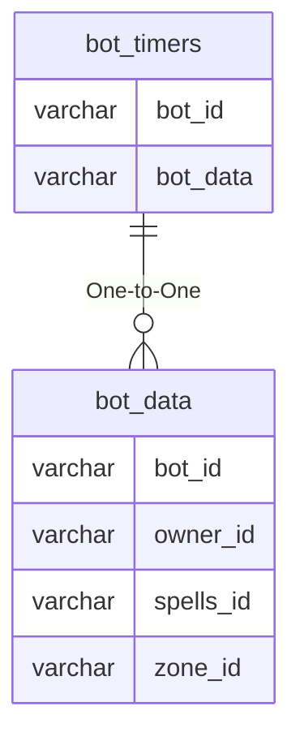

# bot_timers

!!! info
	This page was last generated 2024.02.07

## Relationship Diagram(s)

## Relationships

| Relationship Type | Local Key | Relates to Table | Foreign Key |
| :--- | :--- | :--- | :--- |
| One-to-One | bot_data | [bot_data](../../schema/bots/bot_data.md) | bot_id |

## Schema

| Column | Data Type | Description |
| :--- | :--- | :--- |
| bot_id | int | [Unique Bot Identifier](bot_data.md) |
| timer_id | int | Timer Identifier |
| timer_value | int | Timer Expiration |

