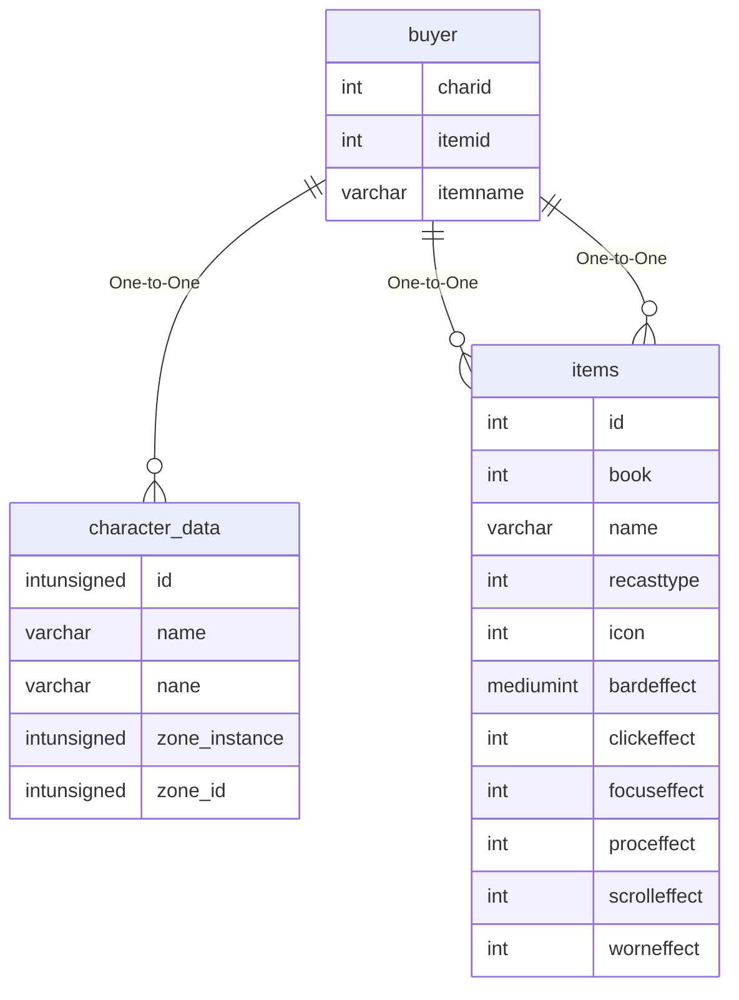

# buyer

!!! info
	This page was last generated 2024.02.07

## Relationship Diagram(s)

## Relationships

| Relationship Type | Local Key | Relates to Table | Foreign Key |
| :--- | :--- | :--- | :--- |
| One-to-One | charid | [character_data](../../schema/characters/character_data.md) | id |
| One-to-One | itemid | [items](../../schema/items/items.md) | id |
| One-to-One | itemname | [items](../../schema/items/items.md) | name |

## Schema

| Column | Data Type | Description |
| :--- | :--- | :--- |
| charid | int | [Character Identifier](../../schema/characters/character_data.md) |
| buyslot | int | Slot |
| itemid | int | [Item Identifier](../../schema/items/items.md) |
| itemname | varchar | [Item Name](../../schema/items/items.md) |
| quantity | int | Quantity |
| price | int | Price |

