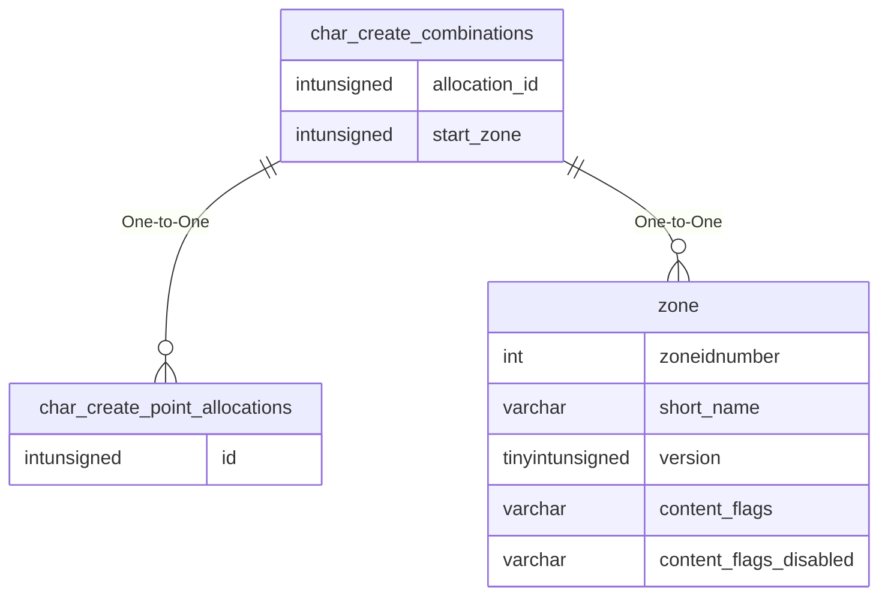

# char_create_combinations

!!! info
	This page was last generated 2024.02.07

## Relationship Diagram(s)

## Relationships

| Relationship Type | Local Key | Relates to Table | Foreign Key |
| :--- | :--- | :--- | :--- |
| One-to-One | allocation_id | [char_create_point_allocations](../../schema/characters/char_create_point_allocations.md) | id |
| One-to-One | start_zone | [zone](../../schema/zone/zone.md) | zoneidnumber |

## Schema

| Column | Data Type | Description |
| :--- | :--- | :--- |
| allocation_id | int | [Allocation Identifier](char_create_point_allocations.md) |
| race | int | [Race](../../../../server/npc/race-list) |
| class | int | [Class](../../../../server/player/class-list) |
| deity | int | [Deity](../../../../server/player/deity-list) |
| start_zone | int | [Start Zone Identifier](../../../../server/zones/zone-list) |
| expansions_req | int | [Expansions Required](../../../../server/operation/expansion-bitmasks) |

